# 이 문서는 소프트웨어의 요구사항을 정리하는 문서입니다. 

## 1. 프로젝트 개요

- 프로젝트명: 컴퓨터공학과 홈페이지 개편
- 발주기관: 한밭대학교 컴퓨터공학과
- 목적: 학과 정보 안내, 학생과의 소통 강화, 학술정보 접근성 향상
- 주요 요청사항: 커뮤니티 게시판, 반응형 웹사이트, 관리자 권한 체계, 보안성 강화
- 제출 형식: GitHub Classroom 레포지토리 내 Markdown 문서

## 2. 사용자 권한 정의

| 권한 그룹       | 설명                                  |
|----------------|---------------------------------------|
| 모두           | 로그인 여부와 관계없이 접근 가능       |
| 학생           | 로그인한 학부생/대학원생              |
| 교수           | 교수 계정으로 로그인한 사용자         |
| 일반 관리자     | 게시판 및 공지사항 관리 권한만 있음   |
| 최고 관리자     | 전체 기능과 권한 설정 가능            |

---
## 3. 시스템 장비 구성 요구사항

## 4. 기능 요구사항

| 코드 | 의미 |
|------|--------------------------------------------|
| FDO  | 학과 소개 (Function Department Overview)   |
| FPR  | 교수진 정보 (Function Professor Roster)    |
| FCC  | 커리큘럼 정보 (Function Curriculum Guide) |
| FNN  | 공지사항 기능 (Function Notice News)       |
| FRS  | 연구 성과 (Function Research Summary)      |
| FAD  | 입학 안내 (Function Admission Detail)      |
| FCM  | 커뮤니티 (Function Community Module)       |
| FAU  | 로그인 (Function Authentication User)      |
| FAR  | 권한 분리 (Function Authorization Role)    |
| FAA  | 실명 인증 (Function Authentication Account)|
| FAM  | 콘텐츠 관리 (Function Admin Management)    |

| 구분 | 고유번호    | 요구사항 명칭               | 권한                                |
|------|-------------|-----------------------------|-------------------------------------|
| FDO  | FDO-001     | 학과 소개 열람 기능          | 모두                                |
| FPR  | FPR-001     | 교수진 소개 열람 기능         | 모두                                |
| FCC  | FCC-001     | 커리큘럼 및 수업 정보 열람 기능 | 모두                                |
| FNN  | FNN-001     | 공지사항 및 뉴스 열람 기능     | 모두                                |
| FRS  | FRS-001     | 연구 성과 열람 기능          | 모두                                |
| FAD  | FAD-001     | 입학 안내 열람 기능          | 모두                                |
| FCM  | FCM-001     | 게시글 작성 기능            | 학생, 교수                          |
|          | FCM-002     | 게시글 수정/삭제 기능         | 학생, 교수                          |
|          | FCM-003     | 댓글 작성/삭제 기능          | 학생, 교수                          |
|          | FCM-004     | 게시글 열람 기능            | 학생, 교수                          |
| FAU  | FAU-001     | 로그인 기능                 | 모두                                |
| FAR  | FAR-001     | 사용자 권한 분리 기능         | 학생, 교수, 일반 관리자             |
| FAA  | FAA-001     | 실명 인증 기능              | 학생, 교수                          |
| FAM  | FAM-001     | 관리자 콘텐츠 관리 기능       | 최고 관리자                         ||

| 항목        | 내용                                                                                    |
| --------- | ------------------------------------------------------------------------------------- |
| 요구사항 고유번호 | FDO-001                                                                            |
| 요구사항 명칭   | 학과 소개 열람 기능                                                                           |
| 요구사항 분류   | 기능 요구사항                                                                               |
| 정의        | 사용자가 학과의 비전, 연혁, 구성 등을 열람할 수 있는 기능                                                    |
| 세부내용      | - 소개 텍스트 표시(비전, 연혁, 구성)   - 소개 이미지 표시(학교 로고, 캠퍼스 전경 사진)   - 모바일에서 가독성 높은 단락 구조 적용  - 관리자 등록 콘텐츠 기반 정적 페이지 제공 |
| 권한        | 모두                                                                                    |

| 항목        | 내용                                                                                                                                  |
| --------- | ----------------------------------------------------------------------------------------------------------------------------------- |
| 요구사항 고유번호 | FPR-001                                               |
| 요구사항 명칭   | 교수진 소개 열람 기능                                           |
| 요구사항 분류   | 기능 요구사항                                                   |
| 정의        | 사용자가 교수진들의 세부 정보를 열람할 수 있는 기능                               |
| 세부내용      | - 교수진 이름 표시  - 직책 표시  - 연구실 위치 안내  - 전공 정보 표시  - 연락처 정보 제공  - 프로필 사진 표시  - 이메일 주소 표시  - 관리자 등록 정보 기반 정적 페이지 제공 |
| 권한        | 모두                                                                                                                                  |

| 항목        | 내용                                                          |
| --------- | ------------------------------------------------------------------- |
| 요구사항 고유번호 | FCC-001                                          |
| 요구사항 명칭   | 커리큘럼 및 수업 정보 열람 기능                                                |
| 요구사항 분류   | 기능 요구사항                                     |
| 정의        | 학과 교육과정 안내 기능                                             |
| 세부내용      | - 학년별 교과 교육 과정 정보 표시  - 과목명 안내  - 학점 안내  - 담당 교수 정보 제공(이미지, 전공, 연구실, 전화번호 등)   - 수업 방식 정보 안내  - 관리자 등록 정보 기반 정적 페이지 제공 |
| 권한        | 모두                                                                |

| 항목        | 내용                                                                                                                 |
| --------- | ------------------------------------------------------------------------------------------------------------------ |
| 요구사항 고유번호 | FNN-001                                                                 |
| 요구사항 명칭   | 공지사항 및 뉴스 열람 기능                                             |
| 요구사항 분류   | 기능 요구사항                                        |
| 정의        | 사용자가 최신 학과 공지사항을 열람할 수 있는 기능                                            |
| 세부내용      | - 공지사항/뉴스 제목 표시  - 내용 표시  - 작성일 표시  - 첨부파일 표시  - 최신순 정렬 기능  - 검색 기능 제공  - 관리자 등록 정보 기반 정적 페이지 제공 |
| 권한        | 모두                                                        |

| 항목        | 내용                                                               |
| --------- | ---------------------------------------------------------------- |
| 요구사항 고유번호 | FRS-001                                                       |
| 요구사항 명칭   | 연구 성과 열람 기능                                                      |
| 요구사항 분류   | 기능 요구사항                                                          |
| 정의        | 연구 논문, 프로젝트, 수상 내역 등을 열람할 수 있는 기능                                |
| 세부내용      | - 연구 성과 최신순 정렬  - 연구 성과 검색 기능 제공  - 관리자 등록 정보 기반 정적 페이지 제공 |
| 권한        | 모두                                                               |

| 항목        | 내용                                                                  |
| --------- | ------------------------------------------------------------------- |
| 요구사항 고유번호 | FAD-001                                                          |
| 요구사항 명칭   | 입학 안내 열람 기능                                                         |
| 요구사항 분류   | 기능 요구사항                                                             |
| 정의        | 입학 전형, 일정, 지원 자격 등의 입학 정보를 열람할 수 있는 기능                              |
| 세부내용      | - 입학 정보 최신순 정렬 기능  - 입학 정보 검색 기능 제공  - 관리자 등록 정보 기반 정적 페이지 제공 |
| 권한        | 모두                                                                  |

| 항목        | 내용                                                                             |
| --------- | ------------------------------------------------------------------------------ |
| 요구사항 고유번호 | FCM-001                                                                     |
| 요구사항 명칭   | 게시글 작성 기능                                                                      |
| 요구사항 분류   | 기능 요구사항                                                                        |
| 정의        | 사용자가 게시판에 새로운 게시글을 작성할 수 있는 기능                                                 |
| 세부내용      | - 게시글 제목 입력 가능  - 게시글 본문 입력 가능  - 첨부파일 등록 가능  - 작성 완료 후 게시글 최신순 정렬 반영 |
| 권한        | 학생, 교수                                                                         |      

| 항목        | 내용                                                                              |
| --------- | ------------------------------------------------------------------------------- |
| 요구사항 고유번호 | FCM-002                                                                      |
| 요구사항 명칭   | 게시글 수정/삭제 기능                                                                    |
| 요구사항 분류   | 기능 요구사항                                                                         |
| 정의        | 사용자가 본인의 게시글을 수정/삭제할 수 있는 기능                                                    |
| 세부내용      | - 로그인된 사용자가 본인 게시글 수정 가능  - 로그인된 사용자가 본인 게시글 삭제 가능  - 삭제 시 ‘복구 불가’ 경고창 표시 |
| 권한        | 학생, 교수                                                                          |

| 항목        | 내용                                                                                  |
| --------- | ----------------------------------------------------------------------------------- |
| 요구사항 고유번호 | FCM-003                                                                          |
| 요구사항 명칭   | 댓글 작성/삭제 기능                                                                         |
| 요구사항 분류   | 기능 요구사항                                                                             |
| 정의        | 로그인한 사용자가 게시글에 댓글을 작성/삭제할 수 있는 기능                                                   |
| 세부내용      | - 댓글 작성 가능 (로그인 사용자)  - 댓글 실시간 반영  - 댓글 좋아요/싫어요 기능 제공  - 댓글 삭제는 댓글 작성자만 가능 |
| 권한        | 학생, 교수                                                                              |

| 항목        | 내용                                                                                            |
| --------- | --------------------------------------------------------------------------------------------- |
| 요구사항 고유번호 | FCM-004                                                                                    |
| 요구사항 명칭   | 게시글 열람 기능                                                                                     |
| 요구사항 분류   | 기능 요구사항                                                                                       |
| 정의        | 로그인 된 사용자가 게시글을 열람할 수 있는 기능                                                                   |
| 세부내용      | - 로그인 사용자만 게시글 열람 가능  - 게시글 제목 표시  - 게시글 내용 표시  - 작성자 정보 표시  - 댓글 표시  - 조회수 표시 |
| 권한        | 모두                                                                                            |

| 항목        | 내용                                                                          |
| --------- | -------------------------------------------------------------------------------------------------------------------------------------- |
| 요구사항 고유번호 | FAU-001                                                          |
| 요구사항 명칭   | 로그인 기능                                                             |
| 요구사항 분류   | 기능 요구사항                                                           |
| 정의        | 사용자 인증을 통해 기능 접근을 제어하는 기능                                          |
| 세부내용      | - 사용자 ID 입력 - 비밀번호 입력 - 사용자 데이터베이스 또는 인증 시스템 연동 - 로그인 성공 여부 출력 - 로그인 성공 시 메인 페이지 이동 또는 권한 별 기능 활성화 - 로그인 실패 시 에러 메시지 출력 |
| 권한        | 모두                                     |

| 항목             | 내용                                                                                          |
|------------------|-----------------------------------------------------------------------------------------------|
| 요구사항 고유번호 | FAR-001                                                                                       |
| 요구사항 명칭      | 사용자 권한 분리 기능                                                                             |
| 요구사항 분류      | 기능 요구사항                                                                                    |
| 정의              | 사용자의 유형에 따라 권한을 분리하여 각 역할별 접근 및 기능 제어를 가능하게 하는 기능                           |
| 세부내용           | - 사용자 유형(학생, 교수, 일반 관리자) 식별 - 로그인 시 권한 분류 기준 적용 - 역할별 메뉴 및 기능 접근 제한 - 관리자 화면 접근 권한 제어 |
| 권한              | 학생, 교수, 일반 관리자                                                                          |

| 항목        | 내용                                                  |
| --------- | -------------------------------------------------------------------------------------------------------------------------- |
| 요구사항 고유번호 | FAA-001                                                                                                                 |
| 요구사항 명칭   | 실명 인증 기능                                                                                                                   |
| 요구사항 분류   | 기능 요구사항                                                                                                                    |
| 정의        | 사용자의 실명을 기반으로 한 인증 절차를 제공하여 보안을 강화하는 기능                                                                                    |
| 세부내용      | - 사용자 이름 입력 - 주민등록번호(또는 학번) 입력 - 사용자 유형(학생, 교수) 입력 - 실명 인증 외부 API 연동 - 인증 성공 시 다음 화면 진행 - 인증 실패 시 에러 메시지 출력 |
| 권한        | 학생, 교수        |

| 항목             | 내용                                                                                              |
|------------------|---------------------------------------------------------------------------------------------------|
| 요구사항 고유번호 | FAM-001                                                                                           |
| 요구사항 명칭      | 관리자 콘텐츠 관리 기능                                                                               |
| 요구사항 분류      | 기능 요구사항                                                                                        |
| 정의              | 관리자 권한으로 콘텐츠의 생성, 수정, 삭제가 가능한 기능                                    |
| 세부내용           | - 콘텐츠 등록/수정/삭제 기능 - 공지사항, 연구 성과 등 연동 대상 선택 - 관리 대상 항목 선택 UI 제공 - 수정 내역 로그 기록 |
| 권한              | 최고 관리자                                                                                          |

## 5. 디자인 요구사항

| 중분류 코드  | 의미                 |
| ------- | ------------------ |
| **UIC** | UI 일관성 (User Interface Consistency)       |
| **RWD** | 반응형 웹 (Responsive Web Design)       |

| 구분                         | 고유번호        | 요구사항 명칭             | 권한 |
| -------------------------- | ----------- | ------------------- | -- |
| **UI 일관성 (NDG-UIC)** | UIC-001 | 디자인 일관성 제공 기능       | 모두 |
| **반응형 웹 (NDG-RWD)**  | RWD-001 | 해상도별 레이아웃 최적화       | 모두 |
|                            | RWD-002 | 모바일 전용 메뉴 제공        | 모두 |
|                            | RWD-003 | 터치 기반 요소 크기 및 간격 조절 | 모두 |

| 항목        | 내용                                        |
| --------- | ----------------------------------------- |
| 요구사항 고유번호 | UIC-001                                   |
| 요구사항 명칭   | 디자인 일관성 제공 기능                             |
| 요구사항 분류   | 디자인 요구사항                                  |
| 정의        | 깔끔하고 전문적인 디자인 제공                          |
| 세부내용      | - 학교 로고 기반 - 폰트, 버튼, 여백 등 일관된 UI 요소 제공      |
| 권한        | 모두  |
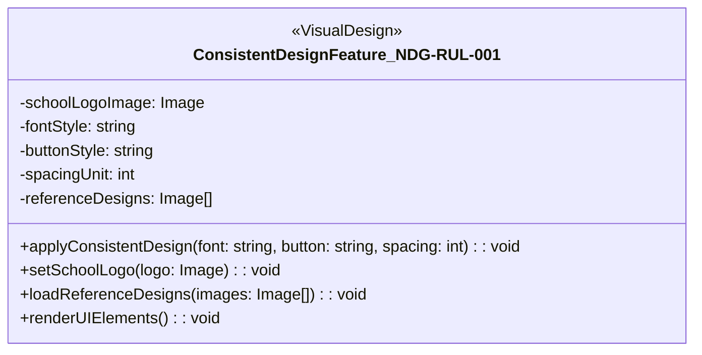

| 항목        | 내용                                                    |
| --------- | ----------------------------------------------------- |
| 요구사항 고유번호 | UIC-001                                               |
| 요구사항 명칭   | 해상도별 레이아웃 최적화                                           |
| 요구사항 분류   | 디자인 요구사항                                              |
| 정의        | 모바일, 태블릿에서도 최적화된 화면 제공                                |
| 세부내용      | - 화면 크기에 따라 자동으로 레이아웃 조정 |
| 권한        | 모두       

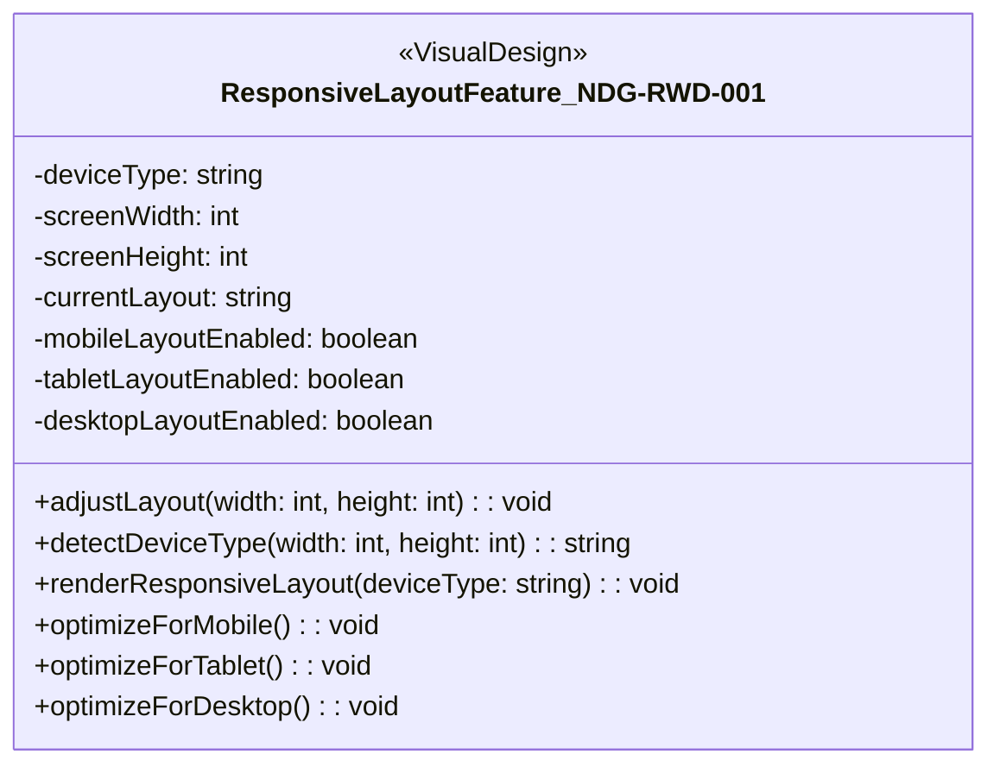

| 항목        | 내용                                                    |
| --------- | ----------------------------------------------------- |
| 요구사항 고유번호 | UIC-002                                               |
| 요구사항 명칭   | 모바일 전용 메뉴 제공                                           |
| 요구사항 분류   | 디자인 요구사항                                              |
| 정의        | 모바일 모드 지원                                |
| 세부내용      | - 햄버거 메뉴, 모바일 메뉴 지원 및 가독성 높은 폰트 자동 배치 |
| 권한        | 모두 

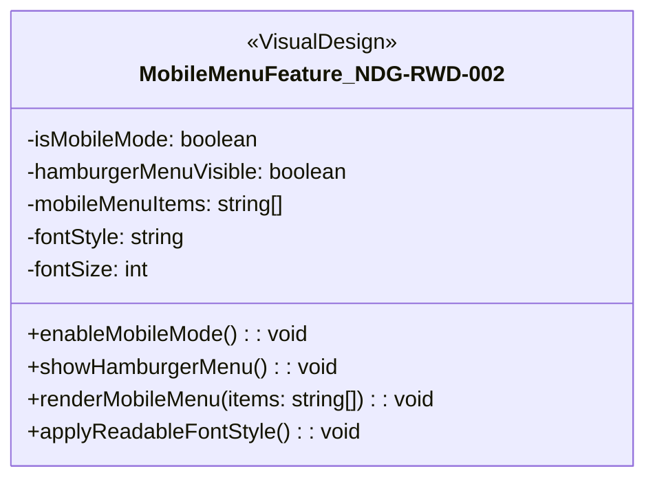

| 항목        | 내용                                                    |
| --------- | ----------------------------------------------------- |
| 요구사항 고유번호 | UIC-003                                               |
| 요구사항 명칭   | 터치 기반 요소 크기 및 간격 조절                                           |
| 요구사항 분류   | 디자인 요구사항                                              |
| 정의        | 모바일 사용자의 원활한 이용                               |
| 세부내용      | - 버튼 간격, 크기 모바일 기준 이상 확보 |
| 권한        | 모두 |

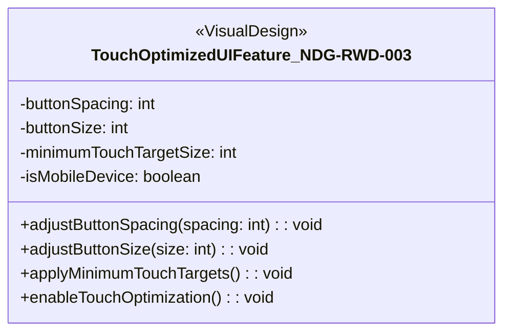

## 6. 인터페이스 요구사항
| 대분류 코드 | 의미                                    |
| ------- | ----------------- |
| **NUI** | 인터페이스 (Interface) |

| 중분류 코드 | 의미                                     |
| ------ | -------------------------------------- |
| NMM    | 메뉴 구성 방식 (상단 고정 메뉴 + 드롭다운 서브메뉴 구조)     |
| NAM    | 권한별 메뉴 표시 (로그인 및 권한에 따라 메뉴 동적 변경)      |
| NFT    | 페이지 전환 흐름 (게시글 목록 → 상세 → 댓글 구조 명확화)    |
| NAC    | 접근성 보장 UI (권한별 UI 차등 구성)               |

| 구분                        | 고유번호        | 요구사항 명칭   | 권한    |
| ------------------------- | ----------- | --------- | ----- |
| **UI - 메뉴 및 내비게이션 (NUI)** | NUI-NMM-001 | 메뉴 구성 방식  | 모두    |
|                           | NUI-NAM-001 | 권한별 메뉴 표시 | 모두    |
|                           | NUI-NFT-001 | 페이지 전환 흐름 | 모두    |
|                           | NUI-NAC-001 | 접근성 보장 UI | 관리자 외 |

| 항목        | 내용                                  |
| --------- | ----------------------------------- |
| 요구사항 고유번호 | NUI-NMM-001                          |
| 요구사항 명칭   | 메뉴 구성 방식                            |
| 요구사항 분류   | 인터페이스 요구사항                          |
| 정의        | 상단 고정 메뉴와 드롭다운 서브메뉴 구성 방식 적용        |
| 세부내용      | - 주요 메뉴는 상단 고정 - 서브메뉴는 드롭다운으로 구성 |
| 권한        | 모두                                  |

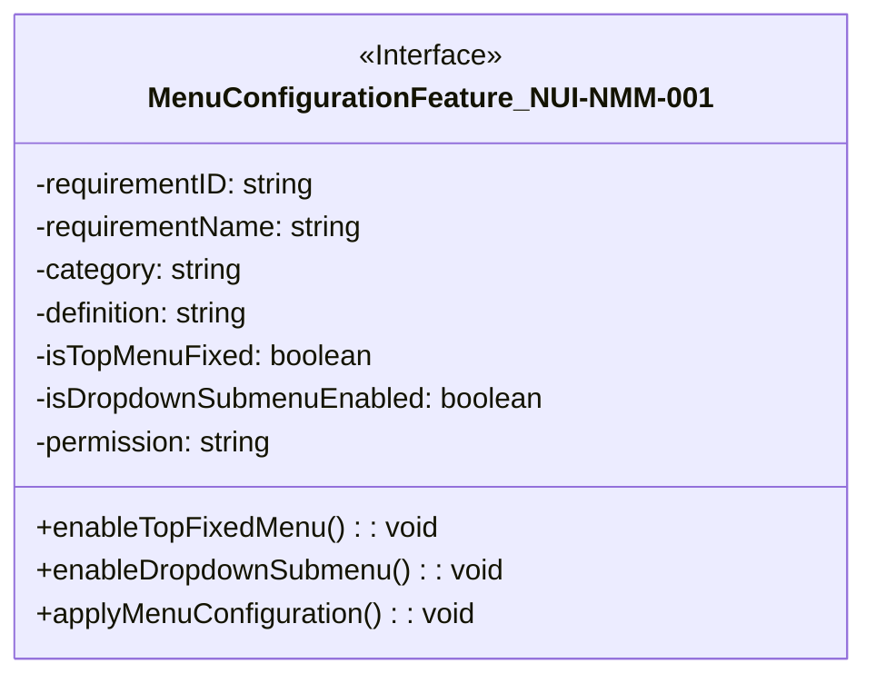

| 항목        | 내용                                     |
| --------- | -------------------------------------- |
| 요구사항 고유번호 | NUI-NAM-001                             |
| 요구사항 명칭   | 권한별 메뉴 표시                              |
| 요구사항 분류   | 인터페이스 요구사항                             |
| 정의        | 로그인 여부 및 권한에 따라 메뉴 항목이 동적으로 변경됨        |
| 세부내용      | - 비로그인 시 제한 메뉴 숨김 - 관리자 전용 메뉴 별도 구성 |
| 권한        | 모두                                     |

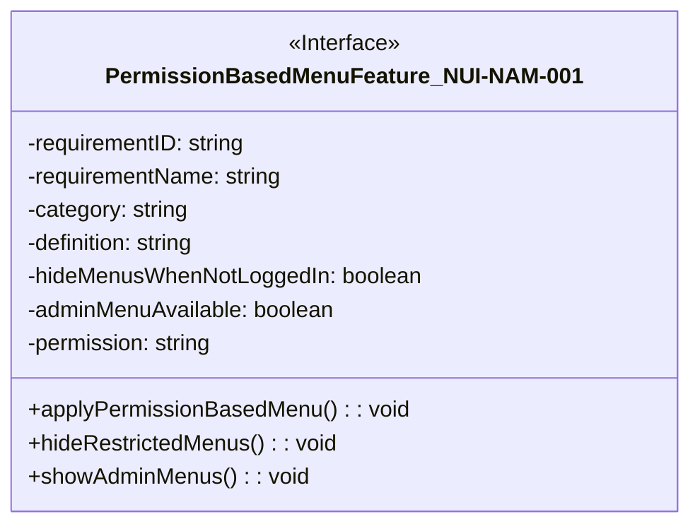

| 항목        | 내용                                   |
| --------- | ------------------------------------ |
| 요구사항 고유번호 | NUI-NFT-001                           |
| 요구사항 명칭   | 페이지 전환 흐름                            |
| 요구사항 분류   | 인터페이스 요구사항                           |
| 정의        | 게시글 목록 → 상세 → 댓글의 명확한 페이지 전환 구조 제공   |
| 세부내용      | - 전환 흐름이 직관적일 것 - 버튼/링크 구분 명확히 표기 |
| 권한        | 모두                                   |

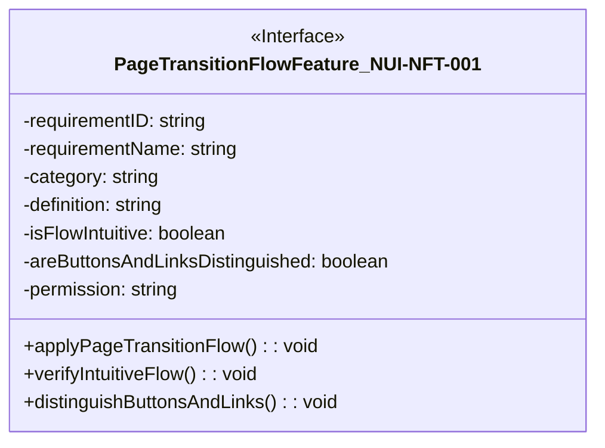

| 항목        | 내용                                  |
| --------- | ----------------------------------- |
| 요구사항 고유번호 | NUI-NAC-001                          |
| 요구사항 명칭   | 접근성 보장 UI                           |
| 요구사항 분류   | 인터페이스 요구사항                          |
| 정의        | 교수, 관리자 등 사용자 유형에 따라 UI를 차등 구성      |
| 세부내용      | - 불필요한 정보 최소화 - 권한별 중요도 중심 UI 구성 |
| 권한        | 모두                                  |

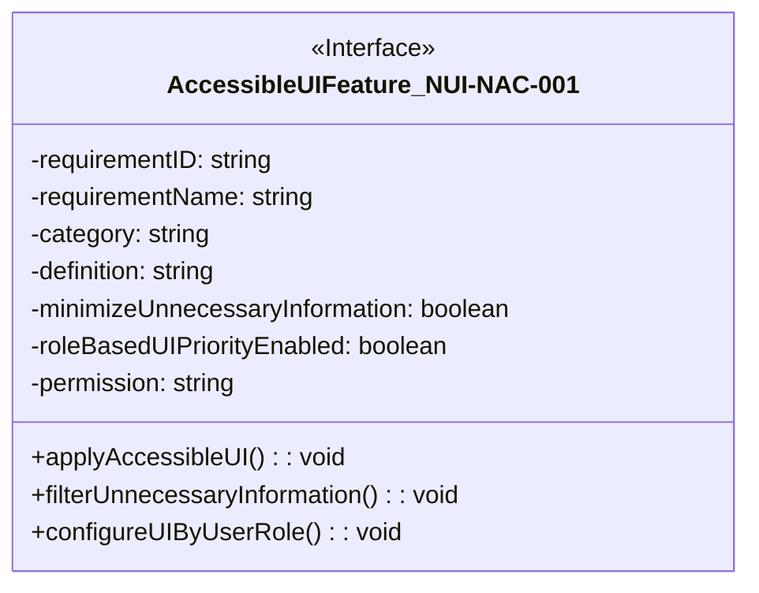

## 7. 소프트웨어 요구사항

| 중분류 코드 | 의미                                     |
| ------ | -------------------------------------------|    
| NFE    | 프론트엔드 프레임워크(Frontend Framework Environment)       |
| NBE    | 백엔드 프레임워크(Backend Framework Environment)  |
| NAP    | API 통신 방식(Network API Protocol)             |
| NJS    | 인증 및 세션 관리(JWT-based Session Management)       |

| 구분                 | 고유번호        | 요구사항 명칭     | 권한  |
| ------------------ | ----------- | ----------- | --- |
|   NFE        | NFE-001 | 프론트엔드 프레임워크 | 관리자 |
|   NBE        | NBE-001 | 백엔드 프레임워크   | 관리자 |
|   NAP        | NAP-001 | API 통신 방식   | 관리자 |
|   NJS        | NJS-001 | 인증 및 세션 관리  | 관리자 |

| 항목        | 내용                                          |
| --------- | ------------------------------------------- |
| 요구사항 고유번호 | NFE-001                                  |
| 요구사항 명칭   | 프론트엔드 프레임워크                                 |
| 요구사항 분류   | 소프트웨어 요구사항                                  |
| 정의        | React 또는 Vue.js 기반 SPA(단일 페이지 애플리케이션) 적용 가능 |
| 세부내용      | - CSR 기반 빠른 화면 전환 - 유지보수 용이한 구조 채택       |
| 권한        | 모두                                          |

| 항목        | 내용                                     |
| --------- | -------------------------------------- |
| 요구사항 고유번호 | NBE-001                             |
| 요구사항 명칭   | 백엔드 프레임워크                              |
| 요구사항 분류   | 소프트웨어 요구사항                             |
| 정의        | Django 또는 Node.js 기반 RESTful API 구조 채택 |
| 세부내용      | - 모듈화 구조 - ORM 또는 비동기 처리 지원         |
| 권한        | 모두                                     |

| 항목        | 내용                                  |
| --------- | ----------------------------------- |
| 요구사항 고유번호 | NAP-001                          |
| 요구사항 명칭   | API 통신 방식                           |
| 요구사항 분류   | 소프트웨어 요구사항                          |
| 정의        | RESTful API 설계에 따른 클라이언트-서버 간 통신 적용 |
| 세부내용      | - HTTP 메서드 활용 - 명확한 URI 구조       |
| 권한        | 모두                                  |

| 항목        | 내용                              |
| --------- | ------------------------------- |
| 요구사항 고유번호 | NJS-001                      |
| 요구사항 명칭   | 인증 및 세션 관리                      |
| 요구사항 분류   | 소프트웨어 요구사항                      |
| 정의        | JWT 기반 인증 및 세션 유지 방식 적용         |
| 세부내용      | - 토큰 기반 로그인 인증 - 세션 만료 시간 설정 |
| 권한        | 모두                              |

## 8. 테스트 요구사항

| 중분류 코드 | 의미                                     |
| ------------- | ---------------------------------- | 
| NUT    | 기능 단위 테스트 (Unit Testing)                  |
| NTF    | 흐름 기반 테스트 (Flow-based Testing)                   |
| NST    | 보안 기능 테스트 (Security Testing)           |
| NRT    | 반응형 UI 테스트 (Responsive UI Testing)           |
| NPT    | 권한 제어 테스트 (Permission Control Testing)             |

| 구분            | 고유번호        | 요구사항 명칭    | 권한  |
| ------------- | ----------- | ---------- | --- |
| NUT           | NUT-001 | 기능 단위 테스트  | 관리자 |
| NTF           | NTF-001 | 흐름 기반 테스트  | 관리자 |
| NST           | NST-001 | 보안 기능 테스트  | 관리자 |
| NRT           | NRT-001 | 반응형 UI 테스트 | 관리자 |
| NPT           | NPT-001 | 권한 제어 테스트  | 관리자 |

| 항목        | 내용                                  |
| --------- | ----------------------------------- |
| 요구사항 고유번호 | NUT-001                          |
| 요구사항 명칭   | 기능 단위 테스트                           |
| 요구사항 분류   | 테스트 요구사항                            |
| 정의        | 로그인, 게시글 등 기능별 동작이 독립적으로 검증 가능해야 함  |
| 세부내용      | - 기능별 단위 테스트 케이스 작성 - 테스트 자동화 지원 |
| 권한        | 모두                                  |

| 항목        | 내용                                 |
| --------- | ---------------------------------- |
| 요구사항 고유번호 | NTF-001                         |
| 요구사항 명칭   | 흐름 기반 테스트                          |
| 요구사항 분류   | 테스트 요구사항                           |
| 정의        | 로그인 → 게시판 → 댓글 등 주요 흐름을 통합적으로 검증   |
| 세부내용      | - 사용자 시나리오 기반 테스트 - 상태 전이 검증 포함 |
| 권한        | 모두                                 |

| 항목        | 내용                                 |
| --------- | ---------------------------------- |
| 요구사항 고유번호 | NST-001                         |
| 요구사항 명칭   | 보안 기능 테스트                          |
| 요구사항 분류   | 테스트 요구사항                           |
| 정의        | 실명 인증, 접근 제어 등 보안 요소 테스트 수행 필요     |
| 세부내용      | - 권한 상승 방지 - 민감 정보 노출 방지 테스트 포함 |
| 권한        | 모두                                 |

| 항목        | 내용                                |
| --------- | --------------------------------- |
| 요구사항 고유번호 | NRT-001                        |
| 요구사항 명칭   | 반응형 UI 테스트                        |
| 요구사항 분류   | 테스트 요구사항                          |
| 정의        | 다양한 해상도 및 디바이스 환경에서 UI 정상 동작 확인   |
| 세부내용      | - 브라우저/기기별 테스트 - 뷰포트별 반응 여부 점검 |
| 권한        | 모두                                |

| 항목        | 내용                                    |
| --------- | ------------------------------------- |
| 요구사항 고유번호 | NPT-001                            |
| 요구사항 명칭   | 권한 제어 테스트                             |
| 요구사항 분류   | 테스트 요구사항                              |
| 정의        | 사용자 권한 별 기능 접근 통제 검증 필요               |
| 세부내용      | - 일반 사용자와 관리자 구분 테스트 - 접근 제한 기능 검증 |
| 권한        | 모두                                    |

## 9. 보안 요구사항

| 중분류 코드  | 의미                 |
| ------- | ------------------ |
| **ENC** | 암호화 (Encryption)      |
| **SSL** | SSL/HTTPS 통신 보안      |
| **RIV** | 실명 인증 (Real Identity Verification)      |
| **ACC** | 접근 제어 (Access Control)      |
| **LOG** | 보안 로깅 및 추적 (Audit Log)      |

| 구분         | 고유번호        | 요구사항 명칭          | 권한      |
| ---------| ----------- | ---------------- | ------- |
| **ENC**   | ENC-001 | 개인정보 저장 시 암호화    | 사용자 개개인 |
|                | ENC-002 | 비밀번호 해시 저장       | 사용자 개개인 |
|  **SSL** |  SSL-001 | SSL 인증서 적용       | 모두      |
|                | SSL-002 | 자동 리디렉션 구성       | 모두      |
|                | SSL-003 | 인증서 만료 모니터링      | 최고 관리자  |
| **RIV**  | RIV-001 | 외부 실명 인증 API 연동  | 학생, 교수  |
|                | RIV-002 | 인증 실패 시 재시도 제한   | 학생, 교수  |
|                | RIV-003 | 인증 로그 기록         | 최고 관리자  |
| **ACC**  | ACC-001 | 권한 기반의 페이지 접근 제어 | 모두      |
|                 | ACC-002 | 관리자 기능 접근 제한     | 최고 관리자  |
| **LOG** | LOG-001 | 로그인 기록 저장        | 최고 관리자  |
|                | LOG-002 | 이상 접근 탐지 알림      | 최고 관리자  |

***

| 항목        | 내용                                                           |
| --------- | ------------------------------------------------------------ |
| 요구사항 고유번호 | ENC-001                                                      |
| 요구사항 명칭   | 개인정보 저장 시 암호화                                                  |
| 요구사항 분류   | 보안 요구사항                                                      |
| 정의        | 사용자 정보 보호를 위한 암호화 저장 제공                                      |
| 세부내용      | - 이름, 이메일, 전화번호 등 개인정보를 DB에 저장 시 AES256 등으로 암호화 |
| 권한        | 사용자 개개인                                                      |

| 항목        | 내용                                                           |
| --------- | ------------------------------------------------------------ |
| 요구사항 고유번호 | ENC-002                                                      |
| 요구사항 명칭   | 비밀번호 해시 저장                                                  |
| 요구사항 분류   | 보안 요구사항                                                      |
| 정의        | 사용자 정보 보호를 위한 비밀번호 저장 제공                                      |
| 세부내용      | - SHA-256 또는 bcrypt 방식으로 해시 저장 |
| 권한        | 사용자 개개인                                                      |

| 항목        | 내용                                                           |
| --------- | ------------------------------------------------------------ |
| 요구사항 고유번호 | SSL-001                                                      |
| 요구사항 명칭   | SSL 인증서 적용                                                 |
| 요구사항 분류   | 보안 요구사항                                                      |
| 정의        | SSL 인증서를 통한 HTTPS 통신 적용                                     |
| 세부내용      | - 사이트가 HTTPS를 통한 암호화된 통신을 하도록 함으로서 보안 강화 |
| 권한        | 모두                                                      |

| 항목        | 내용                                                           |
| --------- | ------------------------------------------------------------ |
| 요구사항 고유번호 | SSL-002                                                      |
| 요구사항 명칭   | 자동 리디렉션 구성                                                 |
| 요구사항 분류   | 보안 요구사항                                                      |
| 정의        | HTTPS 자동 리디렉션 설정                                     |
| 세부내용      | - HTTP로 접근해도 HTTPS로 리디렉션 됨으로써 암호화되지 않은 경로로의 접근 차단 및 보안 유지 |
| 권한        | 모두                                                     |

| 항목        | 내용                                                           |
| --------- | ------------------------------------------------------------ |
| 요구사항 고유번호 | SSL-003                                                      |
| 요구사항 명칭   | 인증서 만료 모니터링                                                |
| 요구사항 분류   | 보안 요구사항                                                      |
| 정의        | SSL 인증서 유효 기간 및 만료 알림                                     |
| 세부내용      | - Certbot등 자동화 도구 사용으로 인증서 만료로 인한 보안 위험 예방 |
| 권한        | 최고 관리자                                                      |

| 항목        | 내용                                                           |
| --------- | ------------------------------------------------------------ |
| 요구사항 고유번호 | RIV-001                                                      |
| 요구사항 명칭   | 외부 실명 인증 API 연동                                                |
| 요구사항 분류   | 보안 요구사항                                                      |
| 정의        | 학교 포털 정보를 통한 인증                                     |
| 세부내용      | - 학교 인증 포털과의 연동을 통해 학교 구성원만이 회원가입이 가능하도록 함 |
| 권한        | 학생, 교수                                                      |

| 항목        | 내용                                                           |
| --------- | ------------------------------------------------------------ |
| 요구사항 고유번호 | RIV-002                                                      |
| 요구사항 명칭   | 인증 실패 시 재시도 제한                                                |
| 요구사항 분류   | 보안 요구사항                                                      |
| 정의        | 지속적 실패로 인한 패널티 부여                                     |
| 세부내용      | - 실명 인증에 대해 일정 횟수(ex 5회) 이상 실패 시 일정 시간 동안 차단 및 최고 관리자 알림 |
| 권한        | 학생, 교수                                                      |

| 항목        | 내용                                                           |
| --------- | ------------------------------------------------------------ |
| 요구사항 고유번호 | RIV-003                                                      |
| 요구사항 명칭   | 인증 로그 기록                                                |
| 요구사항 분류   | 보안 요구사항                                                      |
| 정의        | 인증 관련 모든 로그를 저장                                     |
| 세부내용      | - 최고 관리자만 열람 가능한 파일 또는 DB 저장을 통해 관리 |
| 권한        | 최고 관리자                                                      |

| 항목        | 내용                                                           |
| --------- | ------------------------------------------------------------ |
| 요구사항 고유번호 | ACC-001                                                      |
| 요구사항 명칭   | 권한 기반의 페이지 접근 제어                                                |
| 요구사항 분류   | 보안 요구사항                                                      |
| 정의        | 권한에 따른 접근 페이지 및 기능 제어                                     |
| 세부내용      | - 역할 기반 액세스 제어(RBAC)를 통한 권한 부여 |
| 권한        | 모두                                                      |

| 항목        | 내용                                                           |
| --------- | ------------------------------------------------------------ |
| 요구사항 고유번호 | ACC-002                                                      |
| 요구사항 명칭   | 관리자 기능 접근 제한                                                |
| 요구사항 분류   | 보안 요구사항                                                      |
| 정의        | 최고 관리자의 권한 보호                                     |
| 세부내용      | - 관리자 등급 구분, 추가 인증 및 차단 로직 설계 |
| 권한        | 최고 관리자                                                      |

| 항목        | 내용                                                           |
| --------- | ------------------------------------------------------------ |
| 요구사항 고유번호 | LOG-001                                                      |
| 요구사항 명칭   | 로그인 기록 저장                                                |
| 요구사항 분류   | 보안 요구사항                                                      |
| 정의        | 사용자의 접속시간 등 정보들을 로그 형식으로 저장                                    |
| 세부내용      | - DB 저장 또는 ELK 등을 통한 통합 로그 관리 |
| 권한        | 최고 관리자                                                      |

| 항목        | 내용                                                           |
| --------- | ------------------------------------------------------------ |
| 요구사항 고유번호 | LOG-002                                                      |
| 요구사항 명칭   | 이상 접근 탐지 알림                                                |
| 요구사항 분류   | 보안 요구사항                                                      |
| 정의        | 비정상 접근 등의 이상 징후 발생 시 경고 알림                                    |
| 세부내용      | - IP 기반 차단 또는 메일 등의 알림 시스템 연동 |
| 권한        | 최고 관리자                                                      |

## 10. 품질 요구사항

| 중분류 코드  | 의미                                      | 설명                       |
| --------- | --------------------------------------- | ------------------------ |
| **NMT** | 유지보수 용이성 (Maintainability)              | CMS 기반 콘텐츠 수정, UI 직관성 확보 |
| **NEX**| 기능 확장성 확보 (Extensibility)               | 메뉴/기능 추가 시 구조적 확장 가능     |
| **NUX**  | 사용자 편의성 (User Experience)               | UX 최적화 및 불필요한 클릭 최소화     |
| **NPR**   | 빠른 응답 속도 (Performance / Responsiveness) | 주요 페이지 로딩 시간 2초 이내 목표 설정 |

| 구분           | 고유번호        | 요구사항 명칭               | 권한 |
| ------------ | ----------- | --------------------- | -- |
| **NMT** | NMT-001 | 장애 발생 시 10초 이내 복구     | 모두 |
| **NEX**  | NEX-001 | 시스템 가용성 보장 기능         | 모두 |
| **NUX** | NUX-001 | 에러 발생 시 사용자 피드백 제공 기능 | 모두 |
| **NPR** | NPR-001 | 시스템 반응 시간 제한 기능       | 모두 |

***

| 항목        | 내용                       |
| --------- | ------------------------ |
| 요구사항 고유번호 | NMT-001      |
| 요구사항 명칭   | 장애 발생 시 10초 이내 복구        |
| 요구사항 분류   | 품질 요구사항 - 유지보수 용이성       |
| 정의        | 장애 복구 시 응답 대기 최소화        |
| 세부내용      | - 이중화 서버 자동 전환 등으로 즉각 대응 |
| 권한        | 모두                       |

| 항목        | 내용                                    |
| --------- | ------------------------------------- |
| 요구사항 고유번호 | NEX-001                   |
| 요구사항 명칭   | 시스템 가용성 보장 기능                         |
| 요구사항 분류   | 품질 요구사항 - 기능 확장성 확보                   |
| 정의        | 연중무휴 최소 99.5% 가동률 유지                  |
| 세부내용      | - 서버 이중화 및 모니터링 구성 - 유지보수 시간 사전 공지 |
| 권한        | 모두                                    |

| 항목        | 내용                                                 |
| --------- | -------------------------------------------------- |
| 요구사항 고유번호 | NUX-001                                |
| 요구사항 명칭   | 에러 발생 시 사용자 피드백 제공 기능                              |
| 요구사항 분류   | 품질 요구사항 - 사용자 편의성                                  |
| 정의        | 오류 발생 시 사용자에게 안내 메시지 제공                            |
| 세부내용      | - 사용자에게 원인, 조치 방법 등 제공 - UI에 알림 팝업 또는 경고 메시지 출력 |
| 권한        | 모두                                                 |

| 항목        | 내용                                           |
| --------- | -------------------------------------------- |
| 요구사항 고유번호 | NPR-001                       |
| 요구사항 명칭   | 시스템 반응 시간 제한 기능                              |
| 요구사항 분류   | 품질 요구사항 - 빠른 응답 속도                           |
| 정의        | 사용자 요청에 2초 이내 반응                             |
| 세부내용      | - 주요 기능 클릭 시 2초 이내 응답 - DB 조회/입력 시 병목 최소화 |
| 권한        | 모두                                           |

## 11. 제약 사항

| 대분류 코드  | 의미                   |
| ------- | -------------------- |
| **ENV** | 환경적 제약 (Environment) |
| **TEC** | 기술적 제약 (Technical)   |

| 중분류 | 항목명           | 설명                                                        |
| --- | ------------- | --------------------------------------------------------- |
| **NEX** | 구현 제외 조건      | 과제 목적상 실제 구현은 수행하지 않음                                     |
| **NDL** | 제출 일정 제약      | 학기 내 보고서 제출 일정 엄수 필요                                      |
| **NTM** | 팀 구성 제한       | 외부 인력 참여 없이 팀 내 작성 수행 *(외부 전문가 참여 금지 및 팀 내부 작성 필수)*       |
| **BRC** | 브라우저 호환성 제약   | 크롬, 엣지, 사파리 최신 버전에서만 완전 지원 IE 미지원 및 기능·화면 동일 유지 필요     |
| **OSS** | 오픈소스 사용 제한    | 검증된 오픈소스만 사용 가능 GPL 등 상업적 제약 라이선스 금지 및 관리자 승인 필요       |
| **FRW*** | 언어 및 프레임워크 조건 | 백엔드는 Python, 프론트엔드는 React.js 기반 구현 다른 스택 사용 시 사전 협의 필요 |

| 구분              | 고유번호        | 요구사항 명칭       | 설명                                                        | 권한  |
| --------------- | ----------- | ------------- | --------------------------------------------------------- | --- |
| **환경 제약 (ENV)** | ENV-NEX-001 | 구현 제외 조건      | 과제 목적상 실제 구현은 수행하지 않음                                     | 모두  |
|                 | ENV-NDL-001 | 제출 일정 제약      | 학기 내 보고서 제출 일정 엄수 필요                                      | 모두  |
|                 | ENV-NTM-001 | 팀 구성 제한       | 외부 인력 참여 없이 팀 내 작성 수행 (외부 전문가 참여 금지 및 팀 내부 작성 필수)         | 모두  |
|                 | ENV-BRC-001 | 브라우저 호환성 제약   | 크롬, 엣지, 사파리 최신 버전에서만 완전 지원 IE 미지원 및 기능·화면 동일 유지 필요     | 모두  |
| **기술 제약 (TEC)** | TEC-OSS-001 | 오픈소스 사용 제한    | 검증된 오픈소스만 사용 가능 GPL 등 상업적 제약 라이선스 금지 및 관리자 승인 필요       | 관리자 |
|                 | TEC-FRW-001 | 언어 및 프레임워크 조건 | 백엔드는 Python, 프론트엔드는 React.js 기반 구현 다른 스택 사용 시 사전 협의 필요 | 관리자 |

| 항목        | 내용                            |
| --------- | ----------------------------- |
| 요구사항 고유번호 | ENV-NEX-001               |
| 요구사항 명칭   | 구현 제외 조건                      |
| 요구사항 분류   | 제약 사항                         |
| 정의        | 과제 목적상 실제 구현은 수행하지 않음         |
| 세부내용      | - 실제 기능 구현 대신 설계 및 문서 작성에 집중함 |
| 권한        | 모두                            |
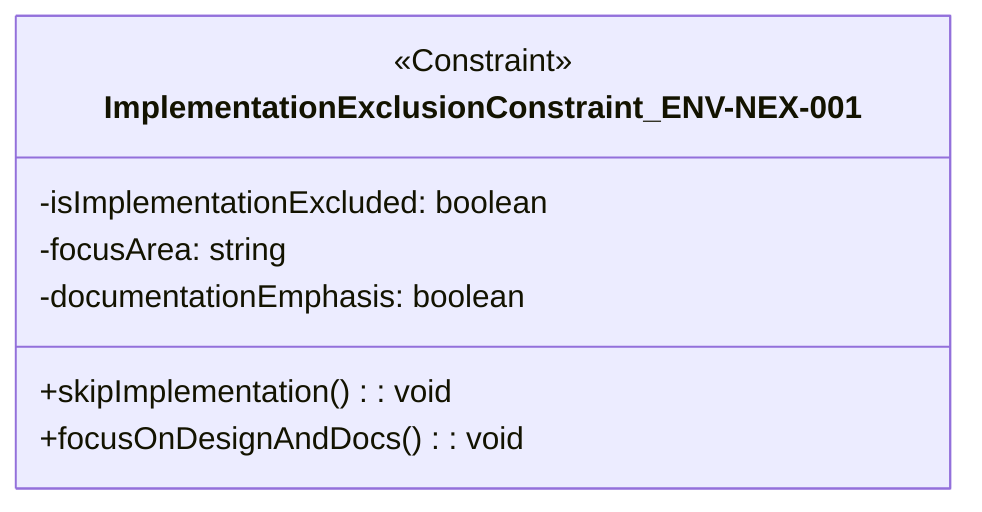

| 항목        | 내용                       |
| --------- | ------------------------ |
| 요구사항 고유번호 | ENV-NDL-001          |
| 요구사항 명칭   | 제출 일정 제약                 |
| 요구사항 분류   | 제약 사항                    |
| 정의        | 학기 내 보고서 제출 일정 엄수 필요     |
| 세부내용      | - 제출 기한 엄수 필수 - 연장 불가 |
| 권한        | 모두                       |
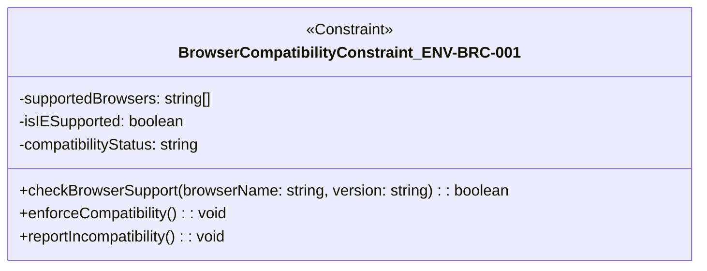

| 항목        | 내용                             |
| --------- | ------------------------------ |
| 요구사항 고유번호 | ENV-NTM-001                |
| 요구사항 명칭   | 팀 구성 제한                        |
| 요구사항 분류   | 제약 사항                          |
| 정의        | 외부 인력 참여 없이 팀 내 작성 수행          |
| 세부내용      | - 외부 전문가 참여 금지 - 팀 내부 작성 필수 |
| 권한        | 모두                             |
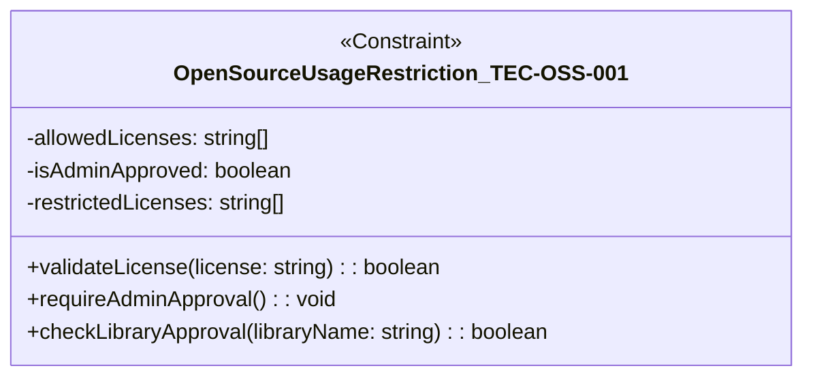

| 항목        | 내용                                 |
| --------- | ---------------------------------- |
| 요구사항 고유번호 | ENV-BRC-001                    |
| 요구사항 명칭   | 브라우저 호환성 제약                        |
| 요구사항 분류   | 제약 사항                              |
| 정의        | 크롬, 엣지, 사파리 최신 버전에서만 완전 지원         |
| 세부내용      | - IE 미지원 - 브라우저별 화면/기능 동일 유지 필요 |
| 권한        | 모두                                 |
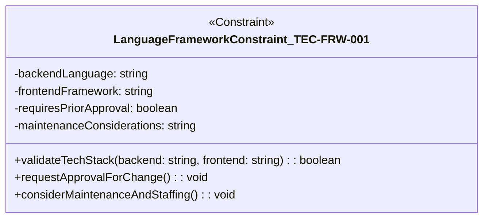

| 항목        | 내용                                                |
| --------- | ------------------------------------------------- |
| 요구사항 고유번호 | TEC-OSS-001                                   |
| 요구사항 명칭   | 오픈소스 사용 제한                                        |
| 요구사항 분류   | 제약 사항                                             |
| 정의        | 검증된 오픈소스만 사용 가능                                   |
| 세부내용      | - GPL 등 상업적 제약 라이선스 금지 - 관리자 승인 없는 라이브러리 도입 불가 |
| 권한        | 관리자                                               |
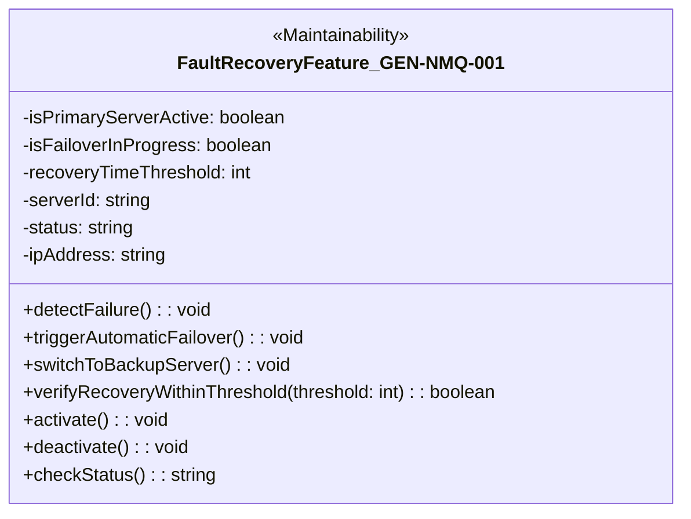

| 항목        | 내용                                         |
| --------- | ------------------------------------------ |
| 요구사항 고유번호 | TEC-FRW-001                            |
| 요구사항 명칭   | 언어 및 프레임워크 조건                              |
| 요구사항 분류   | 제약 사항                                      |
| 정의        | 백엔드는 Python, 프론트엔드는 React.js 기반 구현         |
| 세부내용      | - 다른 스택 사용 시 사전 협의 필요 - 유지보수 및 인력 기준 고려 |
| 권한        | 관리자                                        |
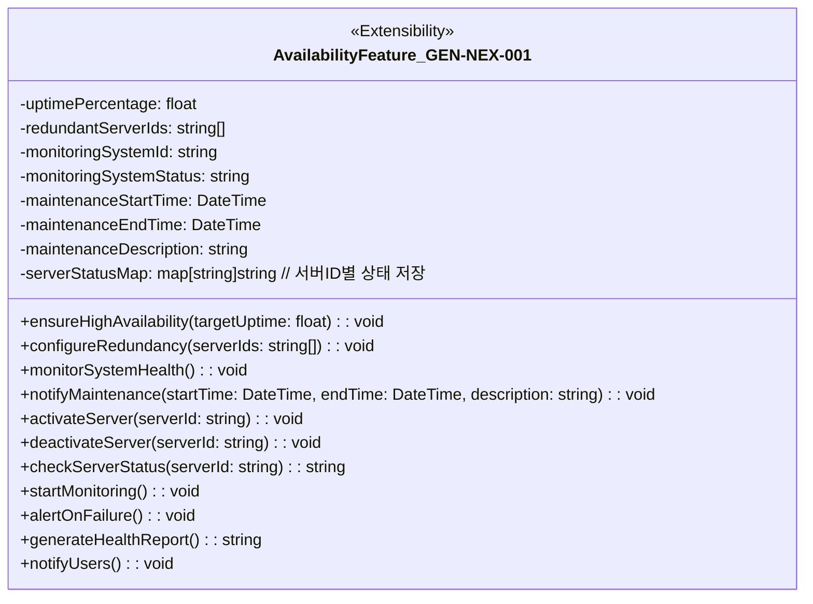
          
## 12. 유지보수 요구사항

| 대분류 코드  | 의미                 |
| ------- | ------------------ |
| **MTN** | 유지보수 (Maintenance) |

| 구분             | 고유번호    | 요구사항 명칭     | 권한  |
| -------------- | ------- | ----------- | --- |
| **유지보수 (MTN)** | MTN-RPM-001 | 정기 유지보수 기능  | 모두  |
|                | MTN-EMG-001 | 긴급 장애 대응 기능 | 모두  |
|                | MTN-CMS-001 | CMS 제공 기능   | 관리자 |

| 항목        | 내용                             |
| --------- | ------------------------------ |
| 요구사항 고유번호 | MTN-RPM-001                        |
| 요구사항 명칭   | 정기 유지보수 기능                     |
| 요구사항 분류   | 유지보수 요구사항                      |
| 정의        | 시스템 정기 점검 및 기능 개선 제공           |
| 세부내용      | - 최소 월 1회 유지보수 - 사전 공지 후 수행 |
| 권한        | 모두                             |

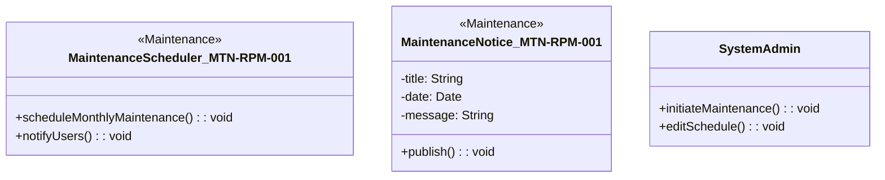

| 항목        | 내용                                          |
| --------- | ------------------------------------------- |
| 요구사항 고유번호 | MTN-EMG-001                                     |
| 요구사항 명칭   | 긴급 장애를 대응하는 기능                              |
| 요구사항 분류   | 유지보수 요구사항                                   |
| 정의        | 시스템 오류 발생 시 24시간 내 대응 제공                    |
| 세부내용      | - 예: 서버 장애, 로그인 오류, 업로드 불가 - 비상 연락 체계 수립 |
| 권한        | 모두                                          |

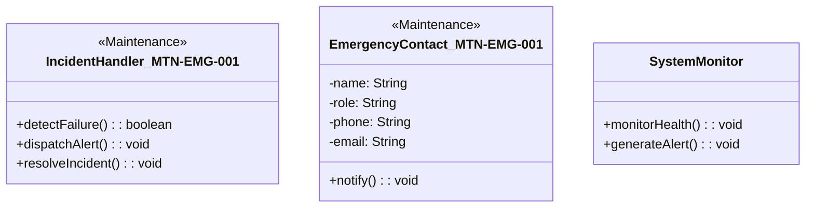

| 항목        | 내용                                                               |
| --------- | ---------------------------------------------------------------- |
| 요구사항 고유번호 | MTN-CMS-001                                                          |
| 요구사항 명칭   | CMS 제공 기능                                                        |
| 요구사항 분류   | 유지보수 요구사항                                                        |
| 정의        | 관리자용 콘텐츠 관리 시스템 제공                                               |
| 세부내용      | - 로그인 기반 관리자 화면 - 게시판/페이지 콘텐츠 등록/수정 UI - 미리보기, 임시 저장 기능 포함 |
| 권한        | 관리자                                                              |

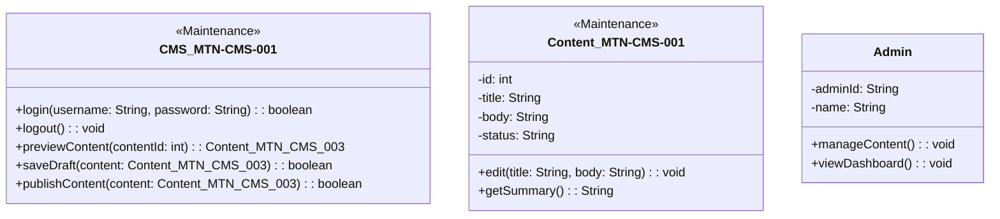

---
---
---
---
---
---
# ☀️요구사항 분석 문서 수정한 내용☀️

# 01. 요구사항 명세서

> **프로젝트명:** 컴퓨터공학과 홈페이지 개편  
> **작성자:** [Team Fire]  
> **문서 목적:**  
> 본 문서는 컴퓨터공학과 홈페이지 개편 프로젝트의 요구사항을 체계적으로 정리한 분석 문서입니다.

---
## 1. 시스템 장비 구성 요구사항

| ID   | 항목명           | 설명                                               |
|------|------------------|----------------------------------------------------|
| NOS  | 서버 운영 체계     | Ubuntu 22.04 이상, Linux 기반 서버 환경              |
| NDB  | 데이터베이스 환경 | MySQL 8.0 또는 PostgreSQL 14 이상                    |
| NCL  | 클라이언트 호환성 | PC, 스마트폰, 태블릿 등 다양한 해상도 지원            |
| NSS  | 보안 연결 방식     | SSL 인증서 기반의 HTTPS 통신 구성 필수               |

---

## 2. 기능 요구사항

| ID   | 기능명              | 설명                                               |
|------|---------------------|----------------------------------------------------|
| FDO  | 학과 소개 페이지       | 학과 비전, 역사 등 소개용 정적 페이지               |
| FPR  | 교수진 정보 페이지     | 교수별 소개, 전공, 연락처 등 제공                   |
| FCC  | 커리큘럼 정보 제공     | 수업 목록, 과목 설명, 강의계획서 링크 포함            |
| FNN  | 공지사항 게시 기능     | 관리자 공지 등록, 사용자 열람, 고정글 설정            |
| FRS  | 연구 성과 공유         | 논문, 특허, 프로젝트 성과 업로드 기능                |
| FAD  | 입학 안내 페이지       | 입시 정보, 상담 안내, 관련 링크 제공                 |
| FCM  | 학생 커뮤니티 게시판   | 게시글 CRUD, 댓글, 고정글, 권한 제어 포함             |
| FAU  | 사용자 로그인 기능     | 회원가입, 로그인, 로그아웃 기능 구현                 |
| FAR  | 사용자 권한 분리       | 일반/교수/관리자/최고관리자 권한 차등 설정            |
| FAA  | 실명 인증 기능         | 본인확인을 위한 외부 실명 인증 API 연동               |
| FAM  | 관리자 콘텐츠 관리     | CMS 기반 콘텐츠 생성/수정 인터페이스 제공             |

---

## 3. 디자인 요구사항

| ID   | 항목명           | 설명                                               |
|------|------------------|----------------------------------------------------|
| NRS  | 반응형 UI 구성     | 해상도별 레이아웃 자동 조정 (모바일 최적화)         |
| NTH  | 학과 색상 테마     | 학과 로고 색상을 기준으로 통일된 디자인              |
| NHD  | 현대적 전문 디자인 | 깔끔하고 심플한 고등교육기관 전문성 표현              |
| NBM  | 벤치마크 UI 참조   | 서울대, KAIST 홈페이지의 디자인 요소 반영            |

---

## 4. 인터페이스 요구사항

| ID   | 항목명           | 설명                                               |
|------|------------------|----------------------------------------------------|
| NMM  | 메뉴 구성 방식     | 상단 고정 메뉴 + 드롭다운 서브메뉴 구조             |
| NAM  | 권한별 메뉴 표시   | 로그인 및 권한에 따라 메뉴 동적 변경                |
| NFT  | 페이지 전환 흐름   | 게시글 목록 → 상세 → 댓글 구조 명확화               |
| NAC  | 접근성 보장 UI     | 교수, 관리자 등 권한별 UI 차등 구성                  |

---

## 5. 소프트웨어 요구사항

| ID   | 항목명               | 설명                                               |
|------|----------------------|----------------------------------------------------|
| NFE  | 프론트엔드 프레임워크   | React 또는 Vue.js 기반 SPA 적용 가능               |
| NBE  | 백엔드 프레임워크       | Django 또는 Node.js 기반 REST API 구조             |
| NAP  | API 통신 방식          | RESTful API 구조 설계                             |
| NJS  | 인증 및 세션 관리      | JWT 토큰 기반 인증 및 세션 관리 방식 적용          |

---

## 6. 테스트 요구사항

| ID   | 항목명             | 설명                                               |
|------|--------------------|----------------------------------------------------|
| NUT  | 기능 단위 테스트     | 기능별 독립적 동작 검증 (로그인, 게시글 등)         |
| NTF  | 흐름 기반 테스트     | 로그인 → 게시판 → 댓글 등 통합 흐름 검증            |
| NST  | 보안 기능 테스트     | 실명 인증, 접근 제어 등 보안 요소 테스트            |
| NRT  | 반응형 UI 테스트     | 해상도 및 디바이스별 UI 이상 여부 확인              |
| NPT  | 권한 제어 테스트     | 사용자 권한 별 기능 접근 테스트                    |

---

## 7. 보안 요구사항

| ID   | 항목명             | 설명                                               |
|------|--------------------|----------------------------------------------------|
| NSA  | 실명 인증 처리       | 외부 API 또는 본인확인 절차 연동 필요               |
| NEN  | 개인정보 암호화       | 이름, 이메일, 비밀번호 등 암호화 저장               |
| NHT  | HTTPS 통신 구성     | 전체 웹사이트 HTTPS 기반 보안 접속 구성             |
| NAR  | 관리자 권한 통제     | 관리자 계정의 세분화 및 접근 권한 분리              |

---

## 8. 품질 요구사항

| ID   | 항목명             | 설명                                               |
|------|--------------------|----------------------------------------------------|
| NMQ  | 유지보수 용이성     | CMS 기반 콘텐츠 수정, UI 직관성 확보               |
| NEX  | 기능 확장성 확보     | 메뉴/기능 추가 시 구조적 확장 가능                 |
| NUX  | 사용자 편의성       | UX 최적화 및 불필요한 클릭 최소화                  |
| NPR  | 빠른 응답 속도      | 주요 페이지 로딩 시간 2초 이내 목표 설정           |

---

## 9. 제약 사항

| ID   | 항목명             | 설명                                               |
|------|--------------------|----------------------------------------------------|
| NEX  | 구현 제외 조건       | 과제 목적상 실제 구현은 수행하지 않음               |
| NDL  | 제출 일정 제약       | 학기 내 보고서 제출 일정 엄수 필요                  |
| NTM  | 팀 구성 제한         | 외부 인력 참여 없이 팀 내 작성 수행                 |

---

## 10. 유지보수 요구사항

| ID   | 항목명             | 설명                                               |
|------|--------------------|----------------------------------------------------|
| NRU  | 정기 점검 계획       | 기능/콘텐츠 정기적 점검 및 개선 필요               |
| NER  | 장애 대응 기준       | 장애 발생 시 24시간 이내 대응 체계 구축            |
| NCM  | 관리자 CMS 제공     | 콘텐츠 추가/수정 기능 제공, UX 중심 관리화면 구성   |

---

## 기능 추적 매핑 표

| 기능명             | 기능 ID | 인터페이스 ID 예시       | 설계 ID 예시         | 테스트 ID 예시       |
|--------------------|---------|---------------------------|-----------------------|-----------------------|
| 커뮤니티 게시판       | FCM     | UI-FCM-001,002,003        | UC-FCM-001            | TC-FCM-001            |
| 사용자 로그인/인증   | FAU     | UI-FAU-001                | UC-FAU-001            | TC-FAU-001            |
| 사용자 권한 관리     | FAR     | UI-FAR-001                | UC-FAR-001            | TC-FAR-001            |
| 공지사항 기능         | FNN     | UI-FNN-001,002            | UC-FNN-001,002        | TC-FNN-001,002        |
| 실명 인증            | FAA     | UI-FAA-001                | UC-FAA-001            | TC-FAA-001            |
| 콘텐츠 관리          | FAM     | UI-FAM-001                | UC-FAM-001            | TC-FAM-001            |
| 커리큘럼 안내         | FCC     | UI-FCC-001                | UC-FCC-001            | TC-FCC-001            |

---
