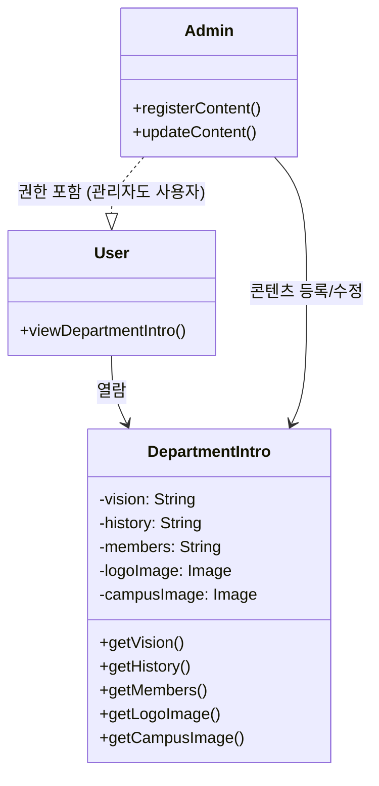
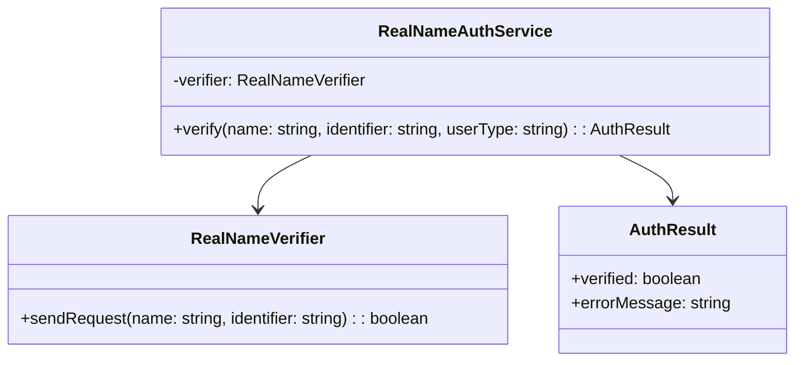
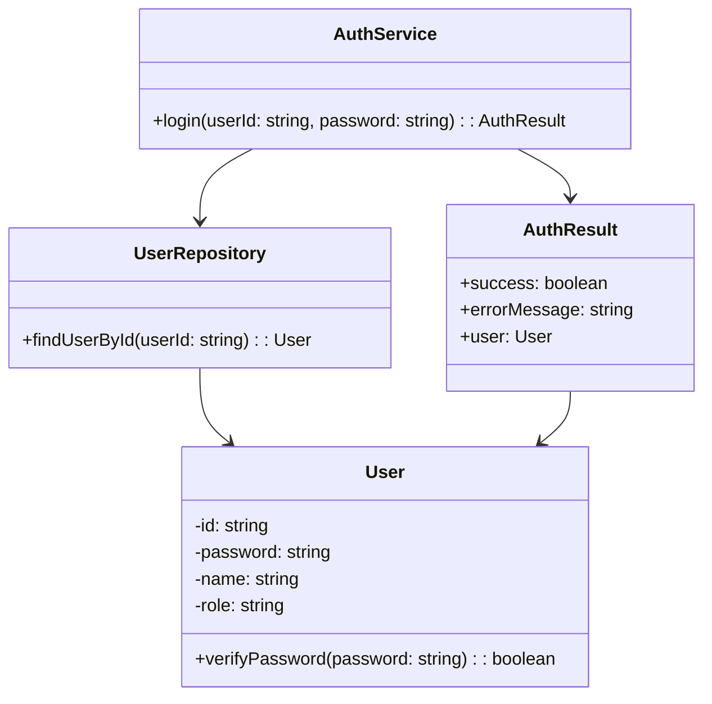
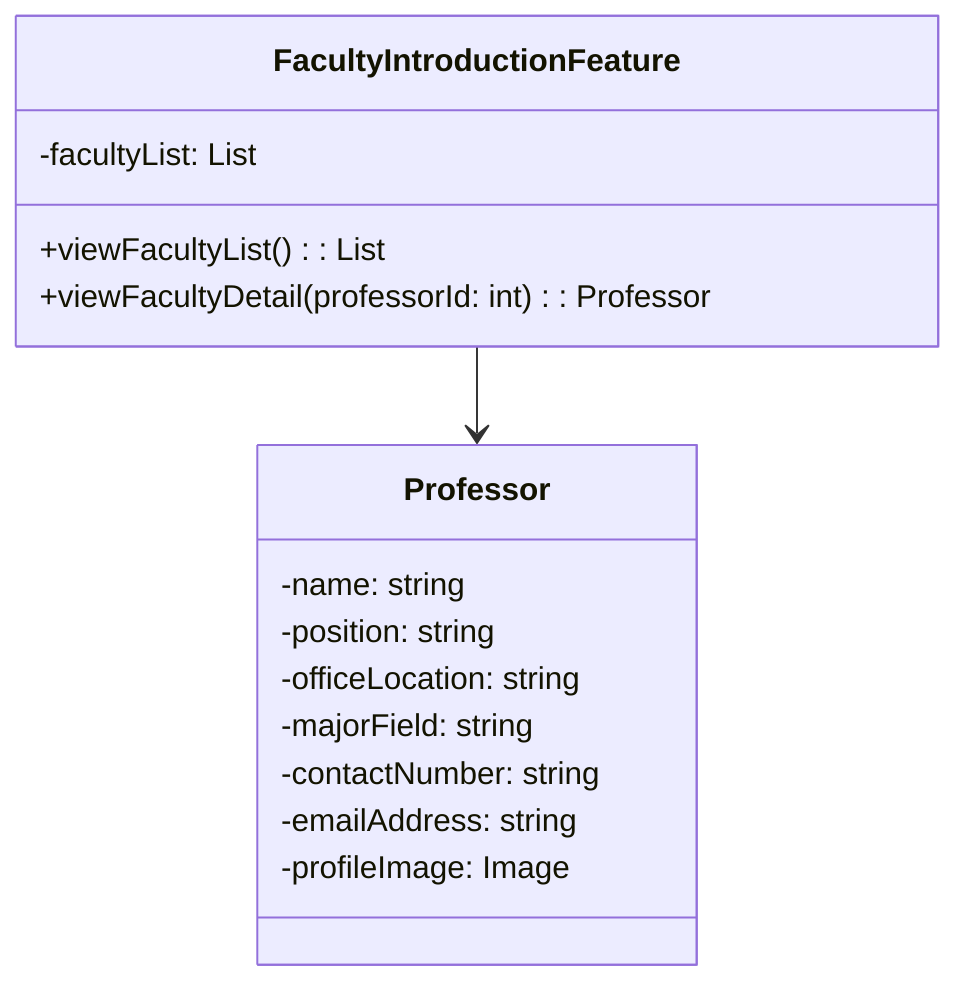
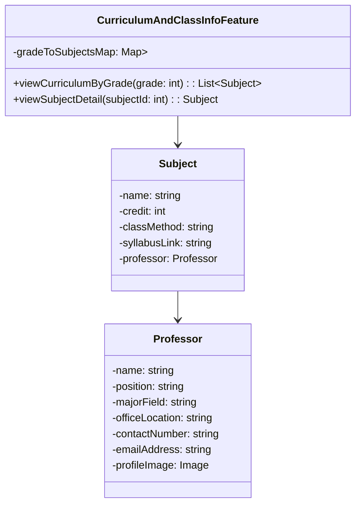

# 이 문서는 소프트웨어의 설계 문서입니다.

(수정 사항)
- 다이어그램
- 시스템 구성도

| 항목           | 내용                                                                 |
|----------------|----------------------------------------------------------------------|
| 기능 ID        | SFC-FCM-001                                                          |
| 기능명         | 게시글 작성/수정/삭제 기능                                           |
| 정의           | 로그인한 사용자가 커뮤니티 게시판에 글을 작성, 수정, 삭제할 수 있는 기능 |
| 입력           | 제목, 본문, 첨부파일                                                 |
| 출력           | 게시글 생성/수정/삭제 결과                                          |
| 대응 요구사항  | FCM-001, FCM-002        

| 항목           | 내용                                                    |
|----------------|---------------------------------------------------------|
| 기능 ID        | SFC-FCM-002                                             |
| 기능명         | 댓글 작성/삭제 기능                                     |
| 정의           | 게시글에 댓글을 작성하고 삭제할 수 있는 기능           |
| 입력           | 댓글 본문, 대상 게시글 ID                               |
| 출력           | 등록/삭제 성공 여부                                    |
| 대응 요구사항  | FCM-003                                                 |

| 항목           | 내용                                                        |
|----------------|-------------------------------------------------------------|
| 기능 ID        | SFC-FCM-003                                                 |
| 기능명         | 게시글 상단 고정 기능                                       |
| 정의           | 관리자/교수가 중요 게시글을 상단에 고정하는 기능           |
| 입력           | 게시글 ID, 고정 여부 설정                                  |
| 출력           | 고정 상태 반영                                              |
| 대응 요구사항  | FCM-004                                                     |

| 항목           | 내용                                                        |
|----------------|-------------------------------------------------------------|
| 기능 ID        | SFC-FCM-004                                                 |
| 기능명         | 게시글 열람 기능                                            |
| 정의           | 로그인한 사용자만 게시글을 열람할 수 있는 기능             |
| 입력           | 게시글 ID                                                  |
| 출력           | 제목, 내용, 댓글, 작성자 등 정보                            |
| 대응 요구사항  | FCM-005                                                     |

| 항목           | 내용                                                        |
|----------------|-------------------------------------------------------------|
| 기능 ID        | SFC-FDO-001                                                 |
| 기능명         | 학과 소개 열람 기능                                         |
| 정의           | 누구나 학과 소개 내용을 열람할 수 있는 기능                 |
| 입력           | 사용자 메뉴 선택 요청                                       |
| 출력           | 비전, 연혁, 구성 등의 콘텐츠                                |
| 대응 요구사항  | FDO-001                                                     |

| 항목           | 내용                                                                        |
|----------------|-----------------------------------------------------------------------------|
| 기능 ID        | SFC-FPR-001                                                                 |
| 기능명         | 교수진 소개 열람 기능                                                       |
| 정의           | 교수 명단, 연구실, 이메일 등 정보를 사용자에게 제공                        |
| 입력           | 사용자 메뉴 선택 요청                                                       |
| 출력           | 교수 이름, 직책, 연구실 위치, 전공, 이메일, 프로필 이미지                   |
| 대응 요구사항  | FPR-001                                                                     |

| 항목           | 내용                                         |
|----------------|----------------------------------------------|
| 기능 ID        | SFC-FCC-001                                  |
| 기능명         | 커리큘럼 및 수업 정보 열람 기능              |
| 정의           | 교과목 리스트, 교수 정보, 수업 방식 제공     |
| 입력           | 사용자 메뉴 선택 요청                        |
| 출력           | 과목명, 학점, 담당 교수, 수업 방식           |
| 대응 요구사항 | FCC-001                                     |

| 항목            | 내용                                         |
|-----------------|----------------------------------------------|
| 기능 ID         | SFC-FNN-001                                  |
| 기능명          | 공지사항 및 뉴스 열람 기능                   |
| 정의            | 최신 학과 공지 및 뉴스 열람 기능             |
| 입력            | 공지사항 열람 요청                           |
| 출력            | 공지 제목, 내용, 첨부파일, 작성일            |
| 대응 요구사항   | FNN-001                                      |

| 항목            | 내용                                                  |
|-----------------|-------------------------------------------------------|
| 기능 ID         | SFC-FNN-002                                           |
| 기능명          | 공지사항 등록/수정 기능                              |
| 정의            | 관리자에 의한 공지 작성, 편집, 삭제 및 상단 고정 기능 |
| 입력            | 제목, 내용, 첨부파일, 고정 여부                       |
| 출력            | 등록/수정 결과                                        |
| 대응 요구사항   | FNN-002                                               |

| 항목            | 내용                                             |
|-----------------|--------------------------------------------------|
| 기능 ID         | SFC-FRS-001                                      |
| 기능명          | 연구 성과 열람 기능                              |
| 정의            | 학과의 연구 논문, 프로젝트, 수상 이력 열람 기능 |
| 입력            | 연구 성과 열람 요청                              |
| 출력            | 논문 목록, 수상 내역, 프로젝트 개요              |
| 대응 요구사항   | FRS-001                                          |

| 항목            | 내용                                           |
|-----------------|------------------------------------------------|
| 기능 ID         | SFC-FAD-001                                    |
| 기능명          | 입학 안내 열람 기능                            |
| 정의            | 입학 전형, 일정, 자격 조건 등 안내             |
| 입력            | 입학 안내 요청                                 |
| 출력            | 전형 정보, 일정, 지원 자격                     |
| 대응 요구사항   | FAD-001                                        |

| 항목            | 내용                                              |
|-----------------|---------------------------------------------------|
| 기능 ID         | SFC-NSC-001                                       |
| 기능명          | 개인정보 암호화 저장 기능                        |
| 정의            | 이름, 이메일 등 주요 정보 암호화 저장 처리       |
| 입력            | 사용자 등록 정보                                 |
| 출력            | 암호화된 저장 결과                               |
| 대응 요구사항   | NSC-001                                          |

| 항목            | 내용                                              |
|-----------------|---------------------------------------------------|
| 기능 ID         | SFC-NSC-002                                       |
| 기능명          | SSL 보안 연결 기능                                |
| 정의            | HTTPS 강제 적용 및 SSL 인증서 연동 처리           |
| 입력            | 없음 (자동 적용)                                 |
| 출력            | HTTPS 접속 환경 제공                             |
| 대응 요구사항   | NSC-002                                          |

----------------------------------------------------------------------------------------------------------------
수정 후

# 03. 소프트웨어 설계 문서 (Software Design Document)

## 1. 문서 개요
이 문서는 컴퓨터공학과 홈페이지 개편 프로젝트의 기능 요구사항을 기반으로, 실제 시스템 구현을 위한 소프트웨어 설계를 정의합니다.  
기능 단위 컴포넌트(SFC)를 기준으로 입력/출력, 처리 흐름, 대응 요구사항 등을 상세히 기술하며, 설계 구조의 확장성과 유지보수성을 확보합니다.

---

## 2. 시스템 아키텍처 개요

### 2.1 시스템 구성도

```
[사용자 (학생/교수/관리자)]
         ↓
[웹 브라우저 (React, HTML)]
         ↓↑ REST API
[서버 (Django/Node.js)]
         ↓↑ ORM / SQL
[DB 서버 (MySQL/PostgreSQL)]
```

- 사용자: 학생, 교수, 관리자
- 프론트엔드: React.js or HTML 기반
- 서버: Django or Node.js
- DB: MySQL, PostgreSQL

---

## 3. 주요 기능 설계 (SFC-XXX-XXX 형식)

| 항목           | 내용                                                                 |
|----------------|----------------------------------------------------------------------|
| 기능 ID        | SFC-FCM-001                                                          |
| 기능명         | 게시글 작성/수정/삭제 기능                                           |
| 정의           | 로그인한 사용자가 커뮤니티 게시판에 글을 작성, 수정, 삭제할 수 있는 기능 |
| 입력           | 제목, 본문, 첨부파일                                                 |
| 출력           | 게시글 생성/수정/삭제 결과                                          |
| 대응 요구사항  | FCM-001, FCM-002        

| 항목           | 내용                                                    |
|----------------|---------------------------------------------------------|
| 기능 ID        | SFC-FCM-002                                             |
| 기능명         | 댓글 작성/삭제 기능                                     |
| 정의           | 게시글에 댓글을 작성하고 삭제할 수 있는 기능           |
| 입력           | 댓글 본문, 대상 게시글 ID                               |
| 출력           | 등록/삭제 성공 여부                                    |
| 대응 요구사항  | FCM-003                                                 |

| 항목           | 내용                                                        |
|----------------|-------------------------------------------------------------|
| 기능 ID        | SFC-FCM-003                                                 |
| 기능명         | 게시글 상단 고정 기능                                       |
| 정의           | 관리자/교수가 중요 게시글을 상단에 고정하는 기능           |
| 입력           | 게시글 ID, 고정 여부 설정                                  |
| 출력           | 고정 상태 반영                                              |
| 대응 요구사항  | FCM-004                                                     |

| 항목           | 내용                                                        |
|----------------|-------------------------------------------------------------|
| 기능 ID        | SFC-FCM-004                                                 |
| 기능명         | 게시글 열람 기능                                            |
| 정의           | 로그인한 사용자만 게시글을 열람할 수 있는 기능             |
| 입력           | 게시글 ID                                                  |
| 출력           | 제목, 내용, 댓글, 작성자 등 정보                            |
| 대응 요구사항  | FCM-005                                                     |

| 항목           | 내용                                                        |
|----------------|-------------------------------------------------------------|
| 기능 ID        | SFC-FDO-001                                                 |
| 기능명         | 학과 소개 열람 기능                                         |
| 정의           | 누구나 학과 소개 내용을 열람할 수 있는 기능                 |
| 입력           | 사용자 메뉴 선택 요청                                       |
| 출력           | 비전, 연혁, 구성 등의 콘텐츠                                |
| 대응 요구사항  | FDO-001                                                     |

| 항목           | 내용                                                                        |
|----------------|-----------------------------------------------------------------------------|
| 기능 ID        | SFC-FPR-001                                                                 |
| 기능명         | 교수진 소개 열람 기능                                                       |
| 정의           | 교수 명단, 연구실, 이메일 등 정보를 사용자에게 제공                        |
| 입력           | 사용자 메뉴 선택 요청                                                       |
| 출력           | 교수 이름, 직책, 연구실 위치, 전공, 이메일, 프로필 이미지                   |
| 대응 요구사항  | FPR-001                                                                     |

| 항목           | 내용                                         |
|----------------|----------------------------------------------|
| 기능 ID        | SFC-FCC-001                                  |
| 기능명         | 커리큘럼 및 수업 정보 열람 기능              |
| 정의           | 교과목 리스트, 교수 정보, 수업 방식 제공     |
| 입력           | 사용자 메뉴 선택 요청                        |
| 출력           | 과목명, 학점, 담당 교수, 수업 방식           |
| 대응 요구사항 | FCC-001                                     |

| 항목            | 내용                                         |
|-----------------|----------------------------------------------|
| 기능 ID         | SFC-FNN-001                                  |
| 기능명          | 공지사항 및 뉴스 열람 기능                   |
| 정의            | 최신 학과 공지 및 뉴스 열람 기능             |
| 입력            | 공지사항 열람 요청                           |
| 출력            | 공지 제목, 내용, 첨부파일, 작성일            |
| 대응 요구사항   | FNN-001                                      |

| 항목            | 내용                                                  |
|-----------------|-------------------------------------------------------|
| 기능 ID         | SFC-FNN-002                                           |
| 기능명          | 공지사항 등록/수정 기능                              |
| 정의            | 관리자에 의한 공지 작성, 편집, 삭제 및 상단 고정 기능 |
| 입력            | 제목, 내용, 첨부파일, 고정 여부                       |
| 출력            | 등록/수정 결과                                        |
| 대응 요구사항   | FNN-002                                               |

| 항목            | 내용                                             |
|-----------------|--------------------------------------------------|
| 기능 ID         | SFC-FRS-001                                      |
| 기능명          | 연구 성과 열람 기능                              |
| 정의            | 학과의 연구 논문, 프로젝트, 수상 이력 열람 기능 |
| 입력            | 연구 성과 열람 요청                              |
| 출력            | 논문 목록, 수상 내역, 프로젝트 개요              |
| 대응 요구사항   | FRS-001                                          |

| 항목            | 내용                                           |
|-----------------|------------------------------------------------|
| 기능 ID         | SFC-FAD-001                                    |
| 기능명          | 입학 안내 열람 기능                            |
| 정의            | 입학 전형, 일정, 자격 조건 등 안내             |
| 입력            | 입학 안내 요청                                 |
| 출력            | 전형 정보, 일정, 지원 자격                     |
| 대응 요구사항   | FAD-001                                        |

| 항목            | 내용                                              |
|-----------------|---------------------------------------------------|
| 기능 ID         | SFC-NSC-001                                       |
| 기능명          | 개인정보 암호화 저장 기능                        |
| 정의            | 이름, 이메일 등 주요 정보 암호화 저장 처리       |
| 입력            | 사용자 등록 정보                                 |
| 출력            | 암호화된 저장 결과                               |
| 대응 요구사항   | NSC-001                                          |

| 항목            | 내용                                              |
|-----------------|---------------------------------------------------|
| 기능 ID         | SFC-NSC-002                                       |
| 기능명          | SSL 보안 연결 기능                                |
| 정의            | HTTPS 강제 적용 및 SSL 인증서 연동 처리           |
| 입력            | 없음 (자동 적용)                                 |
| 출력            | HTTPS 접속 환경 제공                             |
| 대응 요구사항   | NSC-002                                          |


## 4. 요구사항 대응 설계 매핑표

| 기능명             | 요구사항 ID    | 설계 ID (SFC) |
| --------------- | ---------- | ----------- |
| 학과 소개 열람        | FN-FDO-001 | SFC-FDO-001 |
| 교수진 소개 열람       | FN-FPR-001 | SFC-FPR-001 |
| 커리큘럼 및 수업 정보 열람 | FN-FCC-001 | SFC-FCC-001 |
| 공지사항 열람         | FN-FNN-001 | SFC-FNN-001 |
| 공지사항 등록/수정      | FN-FNN-002 | SFC-FNN-002 |
| 연구 성과 열람        | FN-FRS-001 | SFC-FRS-001 |
| 입학 안내 열람        | FN-FAD-001 | SFC-FAD-001 |
| 게시글 작성          | FN-FCM-001 | SFC-FCM-001 |
| 게시글 수정/삭제       | FN-FCM-002 | SFC-FCM-001 |
| 댓글 작성/삭제        | FN-FCM-003 | SFC-FCM-002 |
| 게시글 고정          | FN-FCM-004 | SFC-FCM-003 |
| 게시글 열람          | FN-FCM-005 | SFC-FCM-004 |
| 디자인 일관성 제공      | NF-NDG-001 | SFC-NDG-001 |
| 반응형 웹 제공        | NF-NDG-002 | SFC-NDG-002 |
| 개인정보 암호화 저장     | NF-NSC-001 | SFC-NSC-001 |
| SSL 보안 연결       | NF-NSC-002 | SFC-NSC-002 |
| 실명 인증 기능        | NF-NSC-003 | SFC-NSC-003 |
| 정기 유지보수         | NF-NMT-001 | SFC-NMT-001 |
| 긴급 장애 대응        | NF-NMT-002 | SFC-NMT-002 |
| CMS 제공 기능       | NF-NMT-003 | SFC-NMT-003 |


## 5. 설계 고려사항 및 확장성

### 5.1 설계 전략

- **모듈화 설계**: 인증, 게시판, 공지사항, 커리큘럼 등은 독립된 서비스로 분리
- **보안 강화**: SSL 적용, SHA-256 암호화, JWT 토큰 인증, 실명 인증 API 연동
- **반응형 웹 구현**: 다양한 디바이스에서 자동 레이아웃 조정
- **권한 분리**: 교수/학생/일반 관리자/최고 관리자 등 역할 기반 접근 제어 적용
- **CMS 기반 콘텐츠 수정**: 관리자 UI에서 텍스트, 이미지 직접 수정 가능

### 5.2 유지보수와 확장성

- **확장성 보장**: 메뉴/페이지/기능 추가 시 기존 설계 재활용 가능
- **유지보수 용이성**: 각 기능이 독립적으로 배포 및 수정 가능
- **데이터베이스 정규화**: 게시글, 사용자, 댓글, 관리자 테이블로 구분된 스키마 적용
- **UI 컴포넌트 재사용성**: 각 기능별 화면이 유사한 구성 요소 기반으로 작성됨




---------------------------------------- 최종 수정

**FAA – 실명 인증 기능**

| 항목          | 설명                              |
| ----------- | ------------------------------- |
| **기능 ID**   | FAA                             |
| **기능명**     | 실명 인증 기능                        |
| **목적**      | 사용자 실명을 기반으로 한 인증 절차 제공 및 보안 강화 |
| **대상 사용자**  | 학생, 교수                          |
| **연관 UI**   | UI-FAA-001                      |
| **연관 시나리오** | SC-FAA-001                      |
| **입력**      | 이름, 주민등록번호(또는 학번), 사용자 유형       |
| **출력**      | 인증 성공 여부, 에러 메시지                |
| **외부 연동**   | 실명 인증 외부 API                    |
| **UI 처리**   | 인증 성공 시 다음 화면으로 진행              |


**FAA – 실명 인증 기능 변수 설명**

| 변수명        | 타입      | 설명          |
| ---------- | ------- | ----------- |
| `name`     | string  | 사용자 이름      |
| `idNumber` | string  | 사용자 식별번호    |
| `verified` | boolean | 실명 인증 여부 결과 |

**FAA – 실명 인증 기능 함수 설명**
| 함수명                   | 파라미터                           | 반환형        | 설명                     |
| --------------------- | ------------------------------ | ---------- | ---------------------- |
| `verifyRealName()`    | name: string, idNumber: string | AuthResult | 이름과 주민번호 기반 실명 인증 수행   |
| `isVerified()`        | 없음                             | bool       | 인증 결과 확인               |
| `fetchExternalData()` | idNumber: string               | string     | 외부 인증 시스템에서 사용자 데이터 조회 |

**FAA – 실명 인증 시스템 구성요소** 

| 구성요소                               | 역할                  |
| ---------------------------------- | ------------------- |
| **웹서버**                            | 실명 인증 요청 처리 및 결과 반환 |
| **사용자 브라우저**                       | 이름, 생년월일, 학번 등 입력   |
| **RealNameVerificationFeature 모듈** | 실명 입력값 처리 및 검증      |
| **VerificationServer (외부기관)**      | 외부 실명 인증 API 서버     |
| **인증 결과 DB (선택사항)**                | 검증 완료된 사용자 정보 저장 가능 |

**FAA – 실명 인증 시스템 동작 과정** 
| 단계        | 설명                                                                |
| --------- | ----------------------------------------------------------------- |
| 1. 사용자 입력 | 사용자가 이름, 생년월일, 학번 등을 입력함                                          |
| 2. 인증 요청  | `RealNameVerificationFeature`가 입력 정보를 `verifyRealName` 메서드를 통해 처리 |
| 3. 외부 검증  | `VerificationServer` 클래스를 통해 행정기관 DB 등 외부 시스템과 연동하여 실명 여부 확인      |
| 4. 결과 반환  | 성공 시 실명 인증 완료, 실패 시 오류 메시지 반환                                     |
| 5. 후속 처리  | 실명 인증된 사용자만 가입/로그인/권한 부여 가능 (통합 시스템과 연계됨)                         |

**FAA – 실명 인증 시스템 상호작용**

사용자
  └─> 브라우저 ──> 웹서버 ──> RealNameVerificationFeature
                                   └─> VerificationServer (외부 API)
웹서버
  └─> 인증 결과를 사용자에게 반환
  
**FAA – 실명 인증 설계적 고려사항**

| 고려 항목      | 설명                                   |
| ---------- | ------------------------------------ |
| **신뢰성**    | 외부 인증 기관 API 실패 시 재시도 로직 및 사용자 알림 제공 |
| **보안**     | 사용자 개인정보(이름, 생년월일 등) 전송 시 암호화 필수     |
| **연계성**    | 로그인, 회원가입 등 다른 기능들과 연계된 플로우 설계 필요    |
| **속도 최적화** | 외부 API 응답 시간 지연을 고려한 비동기 처리 가능성 고려   |

**FAU – 로그인 기능**

| 항목          | 설명                                |
| ----------- | --------------------------------- |
| **기능 ID**   | FAU                               |
| **기능명**     | 로그인 기능                            |
| **목적**      | 사용자 인증을 통해 기능 접근 제어               |
| **대상 사용자**  | 모두                                |
| **연관 UI**   | UI-FAU-001                        |
| **연관 시나리오** | SC-FCM-001, SC-FNN-001            |
| **입력**      | 사용자 ID, 비밀번호                      |
| **출력**      | 로그인 성공 여부, 사용자 정보, 에러 메시지         |
| **외부 연동**   | 사용자 데이터베이스 또는 인증 시스템              |
| **UI 처리**   | 로그인 성공 시 메인 페이지 이동 또는 권한 별 기능 활성화 |



**FAU – 로그인 기능 변수 설명**

| 변수명             | 타입     | 설명              |
| --------------- | ------ | --------------- |
| `userId`        | string | 사용자 아이디         |
| `password`      | string | 사용자 비밀번호 (암호화됨) |
| `authenticated` | bool   | 인증 성공 여부        |

**FAU – 로그인 기능 함수 설명**

| 함수명                  | 파라미터                             | 반환형        | 설명                    |
| -------------------- | -------------------------------- | ---------- | --------------------- |
| `login()`            | userId: string, password: string | AuthResult | ID와 비밀번호 기반 로그인 처리    |
| `validatePassword()` | rawPassword: string              | bool       | 비밀번호 일치 여부 확인         |
| `findUserById()`     | userId: string                   | User       | 해당 ID에 해당하는 사용자 정보 조회 |
| `createSession()`    | user: User                       | Session    | 로그인 성공 시 세션 생성 및 반환   |

**FAU – 로그인 기능 시스템 구성요소**

| 구성요소                 | 역할                         |
| -------------------- | -------------------------- |
| **웹서버**              | 로그인 요청을 받아 서버 내부 인증 모듈과 통신 |
| **사용자 브라우저 (클라이언트)** | 로그인 정보를 입력하고 결과를 확인        |
| **LoginFeature 모듈**  | 사용자의 입력을 받아 검증하고 인증 처리     |
| **사용자 계정 DB**        | 사용자 ID, 비밀번호 해시 정보 저장      |
| **SessionManager**   | 인증 완료 시 세션을 생성 및 관리        |

**FAU – 로그인 기능 시스템 동작 과정**

| 단계        | 설명                                                      |
| --------- | ------------------------------------------------------- |
| 1. 사용자 입력 | 사용자가 ID와 비밀번호를 입력함                                      |
| 2. 입력 처리  | `LoginFeature` 클래스가 `inputCredentials` 메서드를 통해 입력값을 저장  |
| 3. 인증 처리  | `authenticate()` 메서드를 호출하여, 사용자 정보와 DB 내 계정 정보 일치 여부 검증 |
| 4. 세션 생성  | 인증 성공 시 `SessionManager`가 세션을 생성하여 사용자 상태를 유지함          |
| 5. 인증 결과  | 성공 시 사용자 정보를 세션에 담고 다음 기능(메인화면 등)으로 이동, 실패 시 오류 메시지 출력  |

**FAU – 로그인 기능 시스템 상호작용**

사용자
  └─> 브라우저 ──> 웹서버 ──> LoginFeature
                                 └─> 사용자 계정 DB 조회
                                 └─> 인증 성공 시 SessionManager
웹서버
  └─> 사용자에게 로그인 결과 응답

**FAU – 로그인 기능 설계적 고려사항**

| 고려 항목     | 설명                                   |
| --------- | ------------------------------------ |
| **보안**    | 비밀번호는 해시 방식으로 저장하고, 통신은 HTTPS로 암호화   |
| **세션 관리** | 인증 성공 시 세션 생성, 세션 타임아웃 및 갱신 로직 필요    |
| **확장성**   | 소셜 로그인(Google, Kakao 등) 추가를 위한 구조 고려 |
| **에러 처리** | 잘못된 로그인 정보, DB 연결 오류 등에 대한 예외 처리 필수  |

**FPR – 교수진 정보 페이지**

| 항목          | 설명                              |
| ----------- | ------------------------------- |
| **기능 ID**   | FPR                             |
| **기능명**     | 교수진 정보 페이지                       |
| **목적**      | 학과 교수진 정보를 사용자에게 제공       |
| **대상 사용자**  | 모두(학생, 교수, 일반인 등)                          |
| **연관 UI**   | UI-FPR-001                      |
| **연관 시나리오** | SC-FPR-001                      |
| **입력**      | 메뉴 클릭, 교수 클릭(상세보기)       |
| **출력**      | 교수 리스트, 교수 상세 정보 |
| **외부 연동**   | 없음             |
| **UI 처리**   | 클릭 시 리스트 표시, 교수 선택 시 상세 정보 및 이미지 출           |


**FPR – 교수진 정보 페이지 변수 설명**

| 변수명        | 타입      | 설명          |
| ---------- | ------- | ----------- |
| `facultyList`     | List<Professor>  | 전체 교수 목록      |
| `professorName`     | string  | 교수 이름      |
| `position` | string  | 직책    |
| `officeLocation` | string | 연구실 위치 |
| `majorField` | string | 전공 분야 |
| `contactNumber` | string | 전화번호 |
| `emailAddress` | string | 이메일 |
| `profileImage` | image | 프로필 이미지 |

**FPR – 교수진 정보 페이지 함수 설명**
| 함수명                   | 파라미터                           | 반환형        | 설명                     |
| --------------------- | ------------------------------ | ---------- | ---------------------- |
| `viewFacultyList()`    | 없음                          | List<Professor>| 전체 교수 목록 반환   |
| `viewFacultyDetail()`  | professorId: int           | Professor       | 선택한 교수의 상세 정보 반환               |

**FPR – 교수진 정보 페이지 시스템 구성요소** 

| 구성요소                               | 역할                  |
| ---------------------------------- | ------------------- |
| **웹서버**                          | 교수 정보 요청 처리 및 HTML 콘텐츠 제공 |
| **사용자 브라우저**                       | 메뉴 클릭, 교수 목록 및 상세 정보 조회 요청/표시   |
| **FacultyIntroductionFeature 모듈** | 교수 데이터 조회 및 처리 수행      |
| **DB 서버**                | 교수 정보 저장 및 제공 |

**FPR – 교수진 정보 페이지 시스템 동작 과정** 
| 단계        | 설명                                                                |
| --------- | ----------------------------------------------------------------- |
| 1. 메뉴 선택 | 사용자가 '교수진 소개'메뉴 클릭                                 |
| 2. 목록 요청  | 웹서버에서 교수 목록 조회 |
| 3. 상세 요청  | 사용자가 교수 선택 시 상세 정보 요청      |
| 4. 데이터 반환  | 교수 상세 정보(이름, 직책, 전공 등) 출력           |

**FPR – 교수진 정보 페이지 시스템 상호작용**

사용자
  └─> 브라우저 ──> 웹서버 ──> FacultyIntroductionFeature
                                   └─> 교수 정보 DB
웹서버
  └─> 교수 목록 or 상세 정보 반환
  
**FPR – 교수진 정보 페이지지 설계적 고려사항**

| 고려 항목      | 설명                                   |
| ---------- | ------------------------------------ |
| **접근성**    | 누구나 교수 정보를 찾을 수 있는 UI 설계 필요 |
| **정확성**     | 관리자에 의한 최신 정보 업데이트 유지     |
| **확장성**    | 교수별 강의, 연구 실적 등 추가 정보 연동 고려    |
| **정적처리** | 관리자 입력 기반 정적 콘텐츠로 처리 시 속도 우수   |

**FCC – 커리큘럼 정보 제공**

| 항목          | 설명                              |
| ----------- | ------------------------------- |
| **기능 ID**   | FCC                             |
| **기능명**     | 커리큘럼 정보 제공                        |
| **목적**      | 학년별 커리큘럼, 강의 정보, 담당 교수 정보 등을 사용자에게 제공 |
| **대상 사용자**  | 모두(학생, 교수, 일반인 등)                          |
| **연관 UI**   | UI-FCC-001                      |
| **연관 시나리오** | SC-FCC-001                      |
| **입력**      | 학년 선택, 강의 선택       |
| **출력**      | 강의명, 학점, 수업 방식, 교수 정보, 강의계획서 링크      |
| **외부 연동**   | 없음             |
| **UI 처리**   | 강의 목록 표시 및 선택 시 강의계획서 링크 제공           |


**FCC – 커리큘럼 정보 제공 변수 설명**

| 변수명        | 타입      | 설명          |
| ---------- | ------- | ----------- |
| `gradeToSubjectsMap`     | Map<int, List<Subject>>  | 학년별 커리큘럼 목록      |
| `name`     | string  | 강의의명      |
| `credit` | int  | 학점    |
| `classMethod` | string | 수업 방식 |
| `syllabusLink` | string | 강의계획서 링크 |
| `professor` | Professor | 담당 교수 정보 |

**FCC – 커리큘럼 정보 제공 함수 설명**
| 함수명                   | 파라미터                           | 반환형        | 설명                     |
| --------------------- | ------------------------------ | ---------- | ---------------------- |
| `viewCurriculumByGrade()`    | grade: int             | List<Subject> | 선택한 학년의 커리큘럼 목록 반환 |
| `viewSubjectDetail()`  | subjectId: int           | Subject       | 강의 상세 정보 반환          |
| `getSyllabusLink()` | subjectId: int               | string     | 강의계획서 PDF 링크 반환 |

**FCC – 커리큘럼 정보 제공 시스템 구성요소** 

| 구성요소                               | 역할                  |
| ---------------------------------- | -------------------------- |
| **웹서버**                         | 커리큘럼 정보 요청 처리 및 HTML 콘텐츠 제공 |
| **사용자 브라우저**                | 학년 선택, 강의 조회, PDF 열람   |
| **CurriculumAndClassInfoFeature 모듈** | 강의 정보 처리 수행      |
| **DB 서버**                | 강의, 교수 정보 저장 및 조회 |
| **파일 서버**                | 강의계획서(PDF) 저장 및 제공 |

**FCC – 커리큘럼 정보 제공 시스템 동작 과정** 
| 단계        | 설명                                                                |
| --------- | ----------------------------------------------------------------- |
| 1. 메뉴 선택 | 사용자가 '커리큘럼 안내'메뉴 선택                                 |
| 2. 학년 선택 | 탭 또는 드롭다운으로 학년 선택 |
| 3. 과목 목록 조회  | 선택 학년의 강의 리스트 출력      |
| 4. 과목 상세 클릭  | 교수 정보, 수업 방식, 강의계획서 링크 제공           |
| 5. 강의계획서 열람  | PDF 다운로드 또는 새 창에서 강의계획서 열람           |

**FCC – 커리큘럼 정보 제공 시스템 상호작용**

사용자
  └─> 브라우저 ──> 웹서버 ──> CurriculumAndClassInfoFeature
                                   └─> 강의, 교수 DB
웹서버
  └─> 강의계획서 PDF 경로 전달
  
**FCC – 커리큘럼 정보 제공 설계적 고려사항**

| 고려 항목      | 설명                                   |
| ---------- | ------------------------------------ |
| **정확성**    | 학년별 강의와 교수 정보 최신 상태 유지 |
| **확장성**     | 교양/전공/선택 구분 추가     |
| **가독성**    | 사용자 친화적 탭 또는 필터 UI 제공    |
| **연동성** | 각 강의별 교수 상세 정보와 연계 가능   |
| **파일 보안** | 강의계획서 PDF 링크 접근 권한 제한 고려 가능   |
