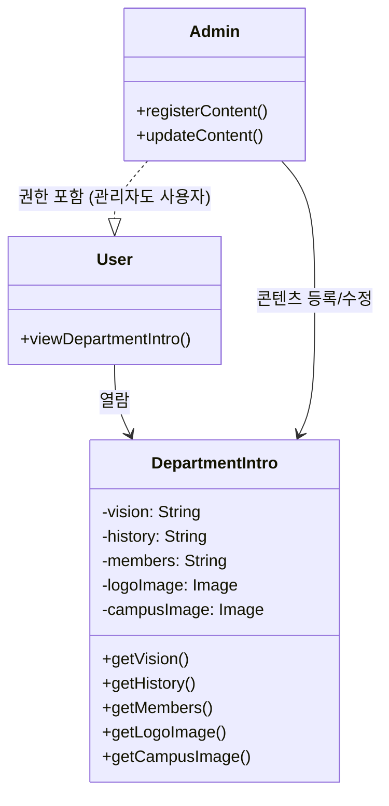

# 이 문서는 소프트웨어의 설계 문서입니다.

(수정 사항)
- 다이어그램
- 시스템 구성도

| 항목           | 내용                                                                 |
|----------------|----------------------------------------------------------------------|
| 기능 ID        | SFC-FCM-001                                                          |
| 기능명         | 게시글 작성/수정/삭제 기능                                           |
| 정의           | 로그인한 사용자가 커뮤니티 게시판에 글을 작성, 수정, 삭제할 수 있는 기능 |
| 입력           | 제목, 본문, 첨부파일                                                 |
| 출력           | 게시글 생성/수정/삭제 결과                                          |
| 대응 요구사항  | FCM-001, FCM-002        

| 항목           | 내용                                                    |
|----------------|---------------------------------------------------------|
| 기능 ID        | SFC-FCM-002                                             |
| 기능명         | 댓글 작성/삭제 기능                                     |
| 정의           | 게시글에 댓글을 작성하고 삭제할 수 있는 기능           |
| 입력           | 댓글 본문, 대상 게시글 ID                               |
| 출력           | 등록/삭제 성공 여부                                    |
| 대응 요구사항  | FCM-003                                                 |

| 항목           | 내용                                                        |
|----------------|-------------------------------------------------------------|
| 기능 ID        | SFC-FCM-003                                                 |
| 기능명         | 게시글 상단 고정 기능                                       |
| 정의           | 관리자/교수가 중요 게시글을 상단에 고정하는 기능           |
| 입력           | 게시글 ID, 고정 여부 설정                                  |
| 출력           | 고정 상태 반영                                              |
| 대응 요구사항  | FCM-004                                                     |

| 항목           | 내용                                                        |
|----------------|-------------------------------------------------------------|
| 기능 ID        | SFC-FCM-004                                                 |
| 기능명         | 게시글 열람 기능                                            |
| 정의           | 로그인한 사용자만 게시글을 열람할 수 있는 기능             |
| 입력           | 게시글 ID                                                  |
| 출력           | 제목, 내용, 댓글, 작성자 등 정보                            |
| 대응 요구사항  | FCM-005                                                     |

| 항목           | 내용                                                        |
|----------------|-------------------------------------------------------------|
| 기능 ID        | SFC-FDO-001                                                 |
| 기능명         | 학과 소개 열람 기능                                         |
| 정의           | 누구나 학과 소개 내용을 열람할 수 있는 기능                 |
| 입력           | 사용자 메뉴 선택 요청                                       |
| 출력           | 비전, 연혁, 구성 등의 콘텐츠                                |
| 대응 요구사항  | FDO-001                                                     |

| 항목           | 내용                                                                        |
|----------------|-----------------------------------------------------------------------------|
| 기능 ID        | SFC-FPR-001                                                                 |
| 기능명         | 교수진 소개 열람 기능                                                       |
| 정의           | 교수 명단, 연구실, 이메일 등 정보를 사용자에게 제공                        |
| 입력           | 사용자 메뉴 선택 요청                                                       |
| 출력           | 교수 이름, 직책, 연구실 위치, 전공, 이메일, 프로필 이미지                   |
| 대응 요구사항  | FPR-001                                                                     |

| 항목           | 내용                                         |
|----------------|----------------------------------------------|
| 기능 ID        | SFC-FCC-001                                  |
| 기능명         | 커리큘럼 및 수업 정보 열람 기능              |
| 정의           | 교과목 리스트, 교수 정보, 수업 방식 제공     |
| 입력           | 사용자 메뉴 선택 요청                        |
| 출력           | 과목명, 학점, 담당 교수, 수업 방식           |
| 대응 요구사항 | FCC-001                                     |

| 항목            | 내용                                         |
|-----------------|----------------------------------------------|
| 기능 ID         | SFC-FNN-001                                  |
| 기능명          | 공지사항 및 뉴스 열람 기능                   |
| 정의            | 최신 학과 공지 및 뉴스 열람 기능             |
| 입력            | 공지사항 열람 요청                           |
| 출력            | 공지 제목, 내용, 첨부파일, 작성일            |
| 대응 요구사항   | FNN-001                                      |

| 항목            | 내용                                                  |
|-----------------|-------------------------------------------------------|
| 기능 ID         | SFC-FNN-002                                           |
| 기능명          | 공지사항 등록/수정 기능                              |
| 정의            | 관리자에 의한 공지 작성, 편집, 삭제 및 상단 고정 기능 |
| 입력            | 제목, 내용, 첨부파일, 고정 여부                       |
| 출력            | 등록/수정 결과                                        |
| 대응 요구사항   | FNN-002                                               |

| 항목            | 내용                                             |
|-----------------|--------------------------------------------------|
| 기능 ID         | SFC-FRS-001                                      |
| 기능명          | 연구 성과 열람 기능                              |
| 정의            | 학과의 연구 논문, 프로젝트, 수상 이력 열람 기능 |
| 입력            | 연구 성과 열람 요청                              |
| 출력            | 논문 목록, 수상 내역, 프로젝트 개요              |
| 대응 요구사항   | FRS-001                                          |

| 항목            | 내용                                           |
|-----------------|------------------------------------------------|
| 기능 ID         | SFC-FAD-001                                    |
| 기능명          | 입학 안내 열람 기능                            |
| 정의            | 입학 전형, 일정, 자격 조건 등 안내             |
| 입력            | 입학 안내 요청                                 |
| 출력            | 전형 정보, 일정, 지원 자격                     |
| 대응 요구사항   | FAD-001                                        |

| 항목            | 내용                                              |
|-----------------|---------------------------------------------------|
| 기능 ID         | SFC-NSC-001                                       |
| 기능명          | 개인정보 암호화 저장 기능                        |
| 정의            | 이름, 이메일 등 주요 정보 암호화 저장 처리       |
| 입력            | 사용자 등록 정보                                 |
| 출력            | 암호화된 저장 결과                               |
| 대응 요구사항   | NSC-001                                          |

| 항목            | 내용                                              |
|-----------------|---------------------------------------------------|
| 기능 ID         | SFC-NSC-002                                       |
| 기능명          | SSL 보안 연결 기능                                |
| 정의            | HTTPS 강제 적용 및 SSL 인증서 연동 처리           |
| 입력            | 없음 (자동 적용)                                 |
| 출력            | HTTPS 접속 환경 제공                             |
| 대응 요구사항   | NSC-002                                          |

----------------------------------------------------------------------------------------------------------------
수정 후

# 03. 소프트웨어 설계 문서 (Software Design Document)

## 1. 문서 개요
이 문서는 컴퓨터공학과 홈페이지 개편 프로젝트의 기능 요구사항을 기반으로, 실제 시스템 구현을 위한 소프트웨어 설계를 정의합니다.  
기능 단위 컴포넌트(SFC)를 기준으로 입력/출력, 처리 흐름, 대응 요구사항 등을 상세히 기술하며, 설계 구조의 확장성과 유지보수성을 확보합니다.

---

## 2. 시스템 아키텍처 개요

### 2.1 시스템 구성도

```
[사용자 (학생/교수/관리자)]
         ↓
[웹 브라우저 (React, HTML)]
         ↓↑ REST API
[서버 (Django/Node.js)]
         ↓↑ ORM / SQL
[DB 서버 (MySQL/PostgreSQL)]
```

- 사용자: 학생, 교수, 관리자
- 프론트엔드: React.js or HTML 기반
- 서버: Django or Node.js
- DB: MySQL, PostgreSQL

---

## 3. 주요 기능 설계 (SFC-XXX-XXX 형식)

| 항목           | 내용                                                                 |
|----------------|----------------------------------------------------------------------|
| 기능 ID        | SFC-FCM-001                                                          |
| 기능명         | 게시글 작성/수정/삭제 기능                                           |
| 정의           | 로그인한 사용자가 커뮤니티 게시판에 글을 작성, 수정, 삭제할 수 있는 기능 |
| 입력           | 제목, 본문, 첨부파일                                                 |
| 출력           | 게시글 생성/수정/삭제 결과                                          |
| 대응 요구사항  | FCM-001, FCM-002        

| 항목           | 내용                                                    |
|----------------|---------------------------------------------------------|
| 기능 ID        | SFC-FCM-002                                             |
| 기능명         | 댓글 작성/삭제 기능                                     |
| 정의           | 게시글에 댓글을 작성하고 삭제할 수 있는 기능           |
| 입력           | 댓글 본문, 대상 게시글 ID                               |
| 출력           | 등록/삭제 성공 여부                                    |
| 대응 요구사항  | FCM-003                                                 |

| 항목           | 내용                                                        |
|----------------|-------------------------------------------------------------|
| 기능 ID        | SFC-FCM-003                                                 |
| 기능명         | 게시글 상단 고정 기능                                       |
| 정의           | 관리자/교수가 중요 게시글을 상단에 고정하는 기능           |
| 입력           | 게시글 ID, 고정 여부 설정                                  |
| 출력           | 고정 상태 반영                                              |
| 대응 요구사항  | FCM-004                                                     |

| 항목           | 내용                                                        |
|----------------|-------------------------------------------------------------|
| 기능 ID        | SFC-FCM-004                                                 |
| 기능명         | 게시글 열람 기능                                            |
| 정의           | 로그인한 사용자만 게시글을 열람할 수 있는 기능             |
| 입력           | 게시글 ID                                                  |
| 출력           | 제목, 내용, 댓글, 작성자 등 정보                            |
| 대응 요구사항  | FCM-005                                                     |

| 항목           | 내용                                                        |
|----------------|-------------------------------------------------------------|
| 기능 ID        | SFC-FDO-001                                                 |
| 기능명         | 학과 소개 열람 기능                                         |
| 정의           | 누구나 학과 소개 내용을 열람할 수 있는 기능                 |
| 입력           | 사용자 메뉴 선택 요청                                       |
| 출력           | 비전, 연혁, 구성 등의 콘텐츠                                |
| 대응 요구사항  | FDO-001                                                     |

| 항목           | 내용                                                                        |
|----------------|-----------------------------------------------------------------------------|
| 기능 ID        | SFC-FPR-001                                                                 |
| 기능명         | 교수진 소개 열람 기능                                                       |
| 정의           | 교수 명단, 연구실, 이메일 등 정보를 사용자에게 제공                        |
| 입력           | 사용자 메뉴 선택 요청                                                       |
| 출력           | 교수 이름, 직책, 연구실 위치, 전공, 이메일, 프로필 이미지                   |
| 대응 요구사항  | FPR-001                                                                     |

| 항목           | 내용                                         |
|----------------|----------------------------------------------|
| 기능 ID        | SFC-FCC-001                                  |
| 기능명         | 커리큘럼 및 수업 정보 열람 기능              |
| 정의           | 교과목 리스트, 교수 정보, 수업 방식 제공     |
| 입력           | 사용자 메뉴 선택 요청                        |
| 출력           | 과목명, 학점, 담당 교수, 수업 방식           |
| 대응 요구사항 | FCC-001                                     |

| 항목            | 내용                                         |
|-----------------|----------------------------------------------|
| 기능 ID         | SFC-FNN-001                                  |
| 기능명          | 공지사항 및 뉴스 열람 기능                   |
| 정의            | 최신 학과 공지 및 뉴스 열람 기능             |
| 입력            | 공지사항 열람 요청                           |
| 출력            | 공지 제목, 내용, 첨부파일, 작성일            |
| 대응 요구사항   | FNN-001                                      |

| 항목            | 내용                                                  |
|-----------------|-------------------------------------------------------|
| 기능 ID         | SFC-FNN-002                                           |
| 기능명          | 공지사항 등록/수정 기능                              |
| 정의            | 관리자에 의한 공지 작성, 편집, 삭제 및 상단 고정 기능 |
| 입력            | 제목, 내용, 첨부파일, 고정 여부                       |
| 출력            | 등록/수정 결과                                        |
| 대응 요구사항   | FNN-002                                               |

| 항목            | 내용                                             |
|-----------------|--------------------------------------------------|
| 기능 ID         | SFC-FRS-001                                      |
| 기능명          | 연구 성과 열람 기능                              |
| 정의            | 학과의 연구 논문, 프로젝트, 수상 이력 열람 기능 |
| 입력            | 연구 성과 열람 요청                              |
| 출력            | 논문 목록, 수상 내역, 프로젝트 개요              |
| 대응 요구사항   | FRS-001                                          |

| 항목            | 내용                                           |
|-----------------|------------------------------------------------|
| 기능 ID         | SFC-FAD-001                                    |
| 기능명          | 입학 안내 열람 기능                            |
| 정의            | 입학 전형, 일정, 자격 조건 등 안내             |
| 입력            | 입학 안내 요청                                 |
| 출력            | 전형 정보, 일정, 지원 자격                     |
| 대응 요구사항   | FAD-001                                        |

| 항목            | 내용                                              |
|-----------------|---------------------------------------------------|
| 기능 ID         | SFC-NSC-001                                       |
| 기능명          | 개인정보 암호화 저장 기능                        |
| 정의            | 이름, 이메일 등 주요 정보 암호화 저장 처리       |
| 입력            | 사용자 등록 정보                                 |
| 출력            | 암호화된 저장 결과                               |
| 대응 요구사항   | NSC-001                                          |

| 항목            | 내용                                              |
|-----------------|---------------------------------------------------|
| 기능 ID         | SFC-NSC-002                                       |
| 기능명          | SSL 보안 연결 기능                                |
| 정의            | HTTPS 강제 적용 및 SSL 인증서 연동 처리           |
| 입력            | 없음 (자동 적용)                                 |
| 출력            | HTTPS 접속 환경 제공                             |
| 대응 요구사항   | NSC-002                                          |


## 4. 요구사항 대응 설계 매핑표

| 기능명             | 요구사항 ID    | 설계 ID (SFC) |
| --------------- | ---------- | ----------- |
| 학과 소개 열람        | FN-FDO-001 | SFC-FDO-001 |
| 교수진 소개 열람       | FN-FPR-001 | SFC-FPR-001 |
| 커리큘럼 및 수업 정보 열람 | FN-FCC-001 | SFC-FCC-001 |
| 공지사항 열람         | FN-FNN-001 | SFC-FNN-001 |
| 공지사항 등록/수정      | FN-FNN-002 | SFC-FNN-002 |
| 연구 성과 열람        | FN-FRS-001 | SFC-FRS-001 |
| 입학 안내 열람        | FN-FAD-001 | SFC-FAD-001 |
| 게시글 작성          | FN-FCM-001 | SFC-FCM-001 |
| 게시글 수정/삭제       | FN-FCM-002 | SFC-FCM-001 |
| 댓글 작성/삭제        | FN-FCM-003 | SFC-FCM-002 |
| 게시글 고정          | FN-FCM-004 | SFC-FCM-003 |
| 게시글 열람          | FN-FCM-005 | SFC-FCM-004 |
| 디자인 일관성 제공      | NF-NDG-001 | SFC-NDG-001 |
| 반응형 웹 제공        | NF-NDG-002 | SFC-NDG-002 |
| 개인정보 암호화 저장     | NF-NSC-001 | SFC-NSC-001 |
| SSL 보안 연결       | NF-NSC-002 | SFC-NSC-002 |
| 실명 인증 기능        | NF-NSC-003 | SFC-NSC-003 |
| 정기 유지보수         | NF-NMT-001 | SFC-NMT-001 |
| 긴급 장애 대응        | NF-NMT-002 | SFC-NMT-002 |
| CMS 제공 기능       | NF-NMT-003 | SFC-NMT-003 |


## 5. 설계 고려사항 및 확장성

### 5.1 설계 전략

- **모듈화 설계**: 인증, 게시판, 공지사항, 커리큘럼 등은 독립된 서비스로 분리
- **보안 강화**: SSL 적용, SHA-256 암호화, JWT 토큰 인증, 실명 인증 API 연동
- **반응형 웹 구현**: 다양한 디바이스에서 자동 레이아웃 조정
- **권한 분리**: 교수/학생/일반 관리자/최고 관리자 등 역할 기반 접근 제어 적용
- **CMS 기반 콘텐츠 수정**: 관리자 UI에서 텍스트, 이미지 직접 수정 가능

### 5.2 유지보수와 확장성

- **확장성 보장**: 메뉴/페이지/기능 추가 시 기존 설계 재활용 가능
- **유지보수 용이성**: 각 기능이 독립적으로 배포 및 수정 가능
- **데이터베이스 정규화**: 게시글, 사용자, 댓글, 관리자 테이블로 구분된 스키마 적용
- **UI 컴포넌트 재사용성**: 각 기능별 화면이 유사한 구성 요소 기반으로 작성됨


