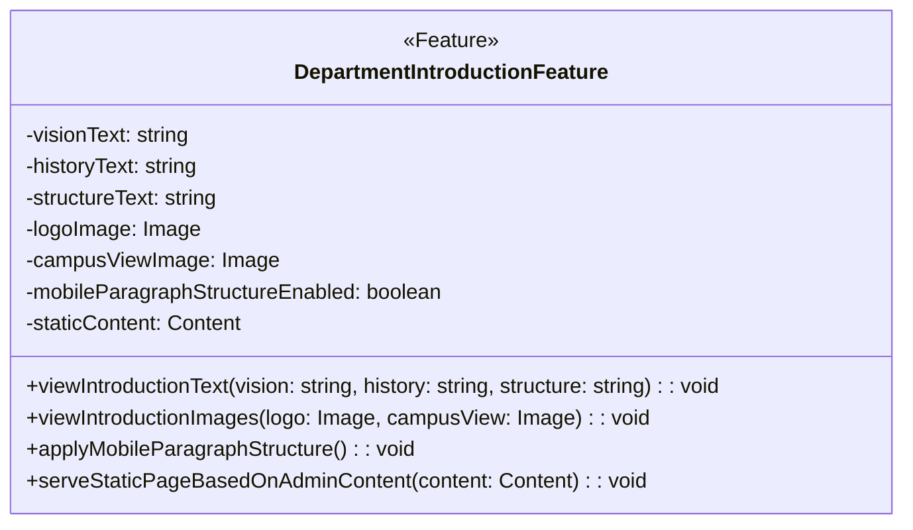
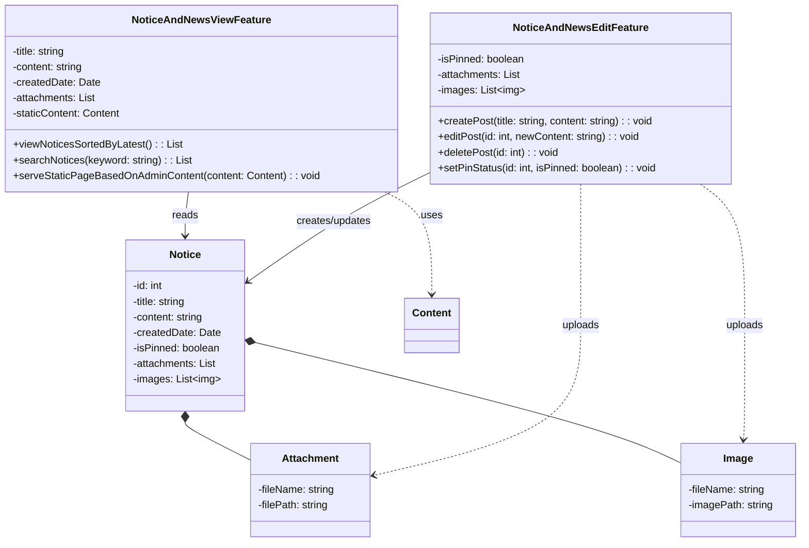

# 이 문서는 소프트웨어의 설계 문서입니다.

# 03. 소프트웨어 설계 문서 (Software Design Document)

## 1. 문서 개요
이 문서는 컴퓨터공학과 홈페이지 개편 프로젝트의 기능 요구사항을 기반으로, 실제 시스템 구현을 위한 소프트웨어 설계를 정의합니다.  
기능 단위 컴포넌트(SFC)를 기준으로 입력/출력, 처리 흐름, 대응 요구사항 등을 상세히 기술하며, 설계 구조의 확장성과 유지보수성을 확보합니다.

---

## 2. 시스템 아키텍처 개요

### 2.1 시스템 구성도

```
[사용자 (학생/교수/관리자)]
         ↓
[웹 브라우저 (React, HTML)]
         ↓↑ REST API
[서버 (Django/Node.js)]
         ↓↑ ORM / SQL
[DB 서버 (MySQL/PostgreSQL)]
```

- 사용자: 학생, 교수, 관리자
- 프론트엔드: React.js or HTML 기반
- 서버: Django or Node.js
- DB: MySQL, PostgreSQL

---

### 2.2 모듈 목록 정의

| 구분 | 고유번호     | 소프트웨어 이름         | 목적                                              | 입력                                                         | 출력                                              | 주요 로직/연동 요소                                                    |
|------|--------------|--------------------------|---------------------------------------------------|--------------------------------------------------------------|---------------------------------------------------|------------------------------------------------------------------------|
| FDO  | SW-FDO-001   | 학과 소개 모듈           | 학과 비전, 연혁, 구성 정보를 정적 콘텐츠로 제공                      | 관리자 등록 콘텐츠 (텍스트, 이미지)                            | 학과 소개 페이지 (비전, 연혁, 구성 텍스트 및 이미지)    | 콘텐츠 저장소에서 정적 콘텐츠 로딩, 모바일 최적화 처리 적용             |
| FPR  | SW-FPR-001   | 교수진 소개 모듈         | 교수 개별 정보(이름, 직책, 전공, 연락처 등) 제공                    | 없음                                                         | 교수 목록 및 상세 정보 (이미지 포함)                  | 교수 DB 조회 (`SELECT * FROM professors`), 상세 보기 함수 연동         |
| FCC  | SW-FCC-001   | 커리큘럼 안내 모듈       | 학년별 강의 목록 및 교수 정보, 강의계획서 링크 제공                 | 학년 선택, 과목 선택                                            | 커리큘럼 리스트, 강의계획서 PDF 링크                  | 커리큘럼 DB 조회, 교수 정보 연계, 강의계획서 파일 경로 반환              |
| FNN  | SW-FNN-001   | 공지사항 열람 모듈       | 등록된 공지사항 목록을 사용자에게 제공                             | 없음                                                         | 공지 리스트 (제목, 날짜, 첨부파일 링크 등)            | 공지사항 DB 조회, 최신순 정렬 처리                                     |
|      | SW-FNN-002   | 공지사항 관리 모듈       | 관리자가 공지사항을 등록 및 수정 가능                              | 제목, 본문, 고정 여부, 첨부파일, 이미지                        | 등록/수정 결과 메시지                                | CRUD 처리, 관리자 권한 확인, 파일 업로드 처리                           |
| FRS  | SW-FRS-001   | 연구 성과 공유 모듈       | 논문, 특허, 프로젝트 등 연구 성과를 연도별 정렬 및 키워드 검색 제공       | 키워드 (선택), 관리자 등록 콘텐츠                              | 연구 성과 리스트, 소개 문구                              | 연구 성과 DB 정렬/검색, 정적 콘텐츠 렌더링 처리                         |
| FAD  | SW-FAD-001   | 입학 안내 모듈           | 입학 일정, 요강, FAQ 등 정보를 제공하여 사용자 이해도 향상              | 관리자 등록 콘텐츠 (전형 정보, FAQ, 일정 등)                   | 입학 안내 페이지                                   | 정적 콘텐츠 렌더링, 키워드 기반 검색, 최신순 정렬 처리                   |
| FCM  | SW-FCM-001   | 게시글 목록 모듈         | 게시판의 글 목록을 조회하고 정렬된 상태로 사용자에게 제공               | 없음                                                         | 게시글 리스트 (고정 여부, 제목, 작성자 등)             | 게시글 DB 조회, 고정/최신순 정렬 반영                                 |
|      | SW-FCM-002   | 게시글 작성 모듈         | 사용자가 커뮤니티 글을 등록할 수 있도록 제공                         | 제목, 본문, 첨부파일, 사용자 정보                               | 작성 성공 여부 메시지                                | 게시글 등록 API 호출, 파일 업로드, 사용자 권한 검증 처리                 |
|      | SW-FCM-003   | 게시글 상세 모듈         | 선택한 게시글 상세 보기, 댓글 조회 및 수정/삭제 제공                  | 게시글 ID, 사용자 정보                                          | 게시글 상세 정보, 댓글 리스트                          | 게시글 상세 DB 조회, 댓글 DB 연동, 권한 확인 로직                        |
| FAU  | SW-FAU-001   | 로그인 모듈             | 사용자 인증 및 세션 생성을 통해 기능 접근 제어                         | 사용자 ID, 비밀번호                                             | 로그인 결과, 사용자 정보, 세션 토큰                   | 사용자 DB 조회, 비밀번호 해시 검증, 세션 생성 및 관리                    |
| FAR  | SW-FAR-001   | 권한 설정 모듈           | 사용자 역할(role)에 따라 접근 가능한 메뉴 및 기능 제어                 | 사용자 ID, 역할 정보                                            | 권한 처리 결과 (허용/차단 여부)                        | 권한 DB 연동, UI 필터링, 접근 검증 함수 처리                            |
| FAA  | SW-FAA-001   | 실명 인증 모듈           | 이름과 식별번호(주민번호/학번)를 기반으로 외부 시스템 연동 인증 수행     | 이름, 주민등록번호 또는 학번, 사용자 유형                        | 인증 성공 여부, 오류 메시지                            | 외부 실명 인증 API 연동, 응답 처리 및 사용자 알림                        |
| FAM  | SW-FAM-001   | 콘텐츠 관리 모듈         | 최고 관리자가 콘텐츠(공지, 소개 등)를 등록/수정할 수 있도록 지원         | 콘텐츠 제목, 본문, 이미지, 표시 위치 등                         | 등록/수정 결과, 적용된 콘텐츠 정보                     | CMS 관리 모듈과 연동, 콘텐츠 저장소(DB 또는 파일) 업데이트                |

## 3. 기능별 상세 정의

| 항목          | 설명                                                                                                           |
| ----------- | ------------------------------------------------------------------------------------------------------------------ |
| 코드        | FDO                                                                                                             |
| 기능명     | 학과 소개 페이지                                                                                               |
| 목적     | 학과의 비전, 연혁, 구성 정보를 사용자에게 제공하여 학과에 대한 전반적인 이해를 돕는다.                                |
| 사용자  | 웹사이트 방문자 모두 (학생, 교직원, 외부인 등)                                                                  |
| 연관 모듈   | SW-FDO-001                                                                                                      |
| 연관 시나리오 | 없음 (정적 페이지로 관리자에 의해 콘텐츠가 미리 등록됨)                                                         |
| 입력      | 학과 비전 설명 텍스트, 학과 연혁 설명 텍스트, 학과 구성 설명 텍스트, 학과 로고 이미지, 캠퍼스 전경 이미지, 모바일 문단 구조 적용 여부, 관리자 등록 정적 콘텐츠 |
| 출력      | 학과 소개 페이지 (텍스트 및 이미지 포함 완성 페이지)                                                              |
| 외부 연동   | 콘텐츠 저장소 (정적 콘텐츠 DB 또는 파일 서버)                                                                 |
| UI 처리   | 사용자 요청 시 학과 소개 콘텐츠를 정적 페이지 형태로 화면에 출력                                                |



**–변수 설명**

| 변수명                             | 타입      | 설명                |
| ------------------------------- | ------- | ----------------- |
| visionText                      | string  | 학과 비전 텍스트         |
| historyText                     | string  | 학과 연혁 텍스트         |
| structureText                   | string  | 학과 구성 설명 텍스트      |
| logoImage                       | Image   | 학과 로고 이미지         |
| campusViewImage                 | Image   | 캠퍼스 전경 이미지        |
| mobileParagraphStructureEnabled | boolean | 모바일에서 문단 구조 적용 여부 |
| staticContent                   | Content | 관리자가 등록한 정적 콘텐츠   |

**–함수 설명**

| 함수명                                  | 파라미터                               | 반환형  | 설명                         |
| ------------------------------------ | ---------------------------------- | ---- | -------------------------- |
| viewIntroductionText()               | vision, history, structure: string | void | 학과 비전, 연혁, 구성 텍스트를 화면에 출력  |
| viewIntroductionImages()             | logo, campusView: Image            | void | 로고 및 캠퍼스 이미지를 화면에 출력       |
| applyMobileParagraphStructure()      | 없음                                 | void | 모바일 화면에서 문단 구조 적용 (가독성 향상) |
| serveStaticPageBasedOnAdminContent() | content: Content                   | void | 등록된 정적 콘텐츠를 기반으로 페이지 렌더링   |

**-시스템 구성요소**

| 구성요소                             | 역할                       |
| -------------------------------- | ------------------------ |
| 웹서버                              | 사용자의 페이지 요청 처리 및 콘텐츠 전달  |
| 콘텐츠 저장소                          | 정적 콘텐츠(텍스트, 이미지 등)를 저장   |
| 관리자 UI                           | 관리자용 콘텐츠 등록/수정 웹 인터페이스   |
| 클라이언트(브라우저)                      | 사용자 요청 및 최종 웹페이지 렌더링     |
| DepartmentIntroductionFeature 모듈 | 콘텐츠 가공, 모바일 최적화 처리 기능 모듈 |

**-시스템 동작 과정**

| 단계         | 설명                                                  |
| ---------- | --------------------------------------------------- |
| 1. 콘텐츠 준비  | 관리자가 Admin UI를 통해 학과 소개 콘텐츠 입력 및 저장                 |
| 2. 사용자 요청  | 사용자가 웹 브라우저에서 학과 소개 페이지 접속                          |
| 3. 페이지 생성  | 웹서버가 콘텐츠를 불러와 DepartmentIntroductionFeature 모듈로 렌더링 |
| 4. 모바일 최적화 | 모바일 기기 또는 설정에 따라 문단 구조 최적화 수행                       |
| 5. 페이지 제공  | 사용자 브라우저에 완성된 페이지 응답 및 렌더링                          |

**–시스템 상호작용**

관리자
 └─> 관리자 UI
     └─> 콘텐츠 저장소 (텍스트, 이미지 저장)

사용자
 └─> 웹 브라우저
     └─> 웹서버
         └─> DepartmentIntroductionFeature
              ├─> 콘텐츠 저장소에서 로드
              ├─> viewIntroductionText()
              ├─> viewIntroductionImages()
              └─> applyMobileParagraphStructure()
         └─> HTML, CSS, 이미지 사용자에게 응답
사용자 브라우저
 └─> 페이지 렌더링 및 표시

**–설계적 고려사항**

| 고려 항목         | 설명                                         |
| ------------- | ------------------------------------------ |
| 정적 콘텐츠 기반 | 자주 변경되지 않는 콘텐츠를 정적으로 관리하여 서버 부하 최소화        |
| 모바일 최적화   | 모바일 환경에서 가독성 향상을 위한 문단 구조 적용 기능 설계         |
| 확장성       | 향후 영상, 다국어, 추가 이미지 등 기능 확장 가능하도록 유연한 구조 설계 |
| 보안        | 관리자 UI 접근 권한 제어, 콘텐츠 무결성 검증, 안전한 콘텐츠 제공 보장 |

---

| 항목          | 설명                              |
| ----------- | ------------------------------- |
| 코드   | FPR                             |
| 기능명     | 교수진 정보 페이지                       |
| 목적      | 학과 교수진 정보를 사용자에게 제공       |
| 사용자  | 모두(학생, 교수, 일반인 등)                          |
| 연관 모듈   | SW-FPR-001                      |
| 연관 시나리오 | SC-FPR-001                      |
| 입력      | 메뉴 클릭, 교수 클릭(상세보기)       |
| 출력      | 교수 리스트, 교수 상세 정보 |
| 외부 연동   | 없음             |
| UI 처리   | 클릭 시 리스트 표시, 교수 선택 시 상세 정보 및 이미지 출력           |


**-변수 설명**

| 변수명        | 타입      | 설명          |
| ---------- | ------- | ----------- |
| `facultyList`     | List<Professor>  | 전체 교수 목록      |
| `professorName`     | string  | 교수 이름      |
| `position` | string  | 직책    |
| `officeLocation` | string | 연구실 위치 |
| `majorField` | string | 전공 분야 |
| `contactNumber` | string | 전화번호 |
| `emailAddress` | string | 이메일 |
| `profileImage` | image | 프로필 이미지 |

**–함수 설명**
| 함수명                   | 파라미터                           | 반환형        | 설명                     |
| --------------------- | ------------------------------ | ---------- | ---------------------- |
| `viewFacultyList()`    | 없음                          | List<Professor>| 전체 교수 목록 반환   |
| `viewFacultyDetail()`  | professorId: int           | Professor       | 선택한 교수의 상세 정보 반환               |

**–시스템 구성요소** 

| 구성요소                               | 역할                  |
| ---------------------------------- | ------------------- |
| 웹서버                          | 교수 정보 요청 처리 및 HTML 콘텐츠 제공 |
| 사용자 브라우저                       | 메뉴 클릭, 교수 목록 및 상세 정보 조회 요청/표시   |
| FacultyIntroductionFeature 모듈 | 교수 데이터 조회 및 처리 수행      |
| DB 서버               | 교수 정보 저장 및 제공 |

**–시스템 동작 과정** 
| 단계        | 설명                                                                |
| --------- | ----------------------------------------------------------------- |
| 1. 메뉴 선택 | 사용자가 '교수진 소개'메뉴 클릭                                 |
| 2. 목록 요청  | 웹서버에서 교수 목록 조회 |
| 3. 상세 요청  | 사용자가 교수 선택 시 상세 정보 요청      |
| 4. 데이터 반환  | 교수 상세 정보(이름, 직책, 전공 등) 출력           |

**–시스템 상호작용**

사용자
  └─> 브라우저 ──> 웹서버 ──> FacultyIntroductionFeature
                                   └─> 교수 정보 DB
웹서버
  └─> 교수 목록 or 상세 정보 반환
  
**–설계적 고려사항**

| 고려 항목      | 설명                                   |
| ---------- | ------------------------------------ |
| 접근성    | 누구나 교수 정보를 찾을 수 있는 UI 설계 필요 |
| 정확성     | 관리자에 의한 최신 정보 업데이트 유지     |
| 확장성    | 교수별 강의, 연구 실적 등 추가 정보 연동 고려    |
| 정적처리 | 관리자 입력 기반 정적 콘텐츠로 처리 시 속도 우수   |

---

| 항목          | 설명                              |
| ----------- | ------------------------------- |
| 코드   | FCC                             |
| 기능명     | 커리큘럼 정보 제공                        |
| 목적      | 학년별 커리큘럼, 강의 정보, 담당 교수 정보 등을 사용자에게 제공 |
| 사용자  | 모두(학생, 교수, 일반인 등)                          |
| 연관 모듈   | SW-FCC-001                      |
| 연관 시나리오 | SC-FCC-001                      |
| 입력      | 학년 선택, 강의 선택       |
| 출력      | 강의명, 학점, 수업 방식, 교수 정보, 강의계획서 링크      |
| 외부 연동   | 없음             |
| UI 처리   | 강의 목록 표시 및 선택 시 강의계획서 링크 제공           |


**–변수 설명**

| 변수명        | 타입      | 설명          |
| ---------- | ------- | ----------- |
| `gradeToSubjectsMap`     | Map<int, List<Subject>>  | 학년별 커리큘럼 목록      |
| `name`     | string  | 강의의명      |
| `credit` | int  | 학점    |
| `classMethod` | string | 수업 방식 |
| `syllabusLink` | string | 강의계획서 링크 |
| `professor` | Professor | 담당 교수 정보 |

**–함수 설명**
| 함수명                   | 파라미터                           | 반환형        | 설명                     |
| --------------------- | ------------------------------ | ---------- | ---------------------- |
| `viewCurriculumByGrade()`    | grade: int             | List<Subject> | 선택한 학년의 커리큘럼 목록 반환 |
| `viewSubjectDetail()`  | subjectId: int           | Subject       | 강의 상세 정보 반환          |
| `getSyllabusLink()` | subjectId: int               | string     | 강의계획서 PDF 링크 반환 |

**–시스템 구성요소** 

| 구성요소                               | 역할                  |
| ---------------------------------- | -------------------------- |
| 웹서버                         | 커리큘럼 정보 요청 처리 및 HTML 콘텐츠 제공 |
| 사용자 브라우저                | 학년 선택, 강의 조회, PDF 열람   |
| CurriculumAndClassInfoFeature 모듈 | 강의 정보 처리 수행      |
| DB 서버               | 강의, 교수 정보 저장 및 조회 |
| 파일 서버                | 강의계획서(PDF) 저장 및 제공 |

**–시스템 동작 과정** 
| 단계        | 설명                                                                |
| --------- | ----------------------------------------------------------------- |
| 1. 메뉴 선택 | 사용자가 '커리큘럼 안내'메뉴 선택                                 |
| 2. 학년 선택 | 탭 또는 드롭다운으로 학년 선택 |
| 3. 과목 목록 조회  | 선택 학년의 강의 리스트 출력      |
| 4. 과목 상세 클릭  | 교수 정보, 수업 방식, 강의계획서 링크 제공           |
| 5. 강의계획서 열람  | PDF 다운로드 또는 새 창에서 강의계획서 열람           |

**-시스템 상호작용**

사용자
  └─> 브라우저 ──> 웹서버 ──> CurriculumAndClassInfoFeature
                                   └─> 강의, 교수 DB
웹서버
  └─> 강의계획서 PDF 경로 전달
  
**–설계적 고려사항**

| 고려 항목      | 설명                                   |
| ---------- | ------------------------------------ |
| 정확성    | 학년별 강의와 교수 정보 최신 상태 유지 |
| 확장성     | 교양/전공/선택 구분 추가     |
| 가독성    | 사용자 친화적 탭 또는 필터 UI 제공    |
| 연동성 | 각 강의별 교수 상세 정보와 연계 가능   |
| 파일 보안 | 강의계획서 PDF 링크 접근 권한 제한 고려 가능   |

---

| 항목 | 설명 |
|------|------|
| 코드 | FAA  |
| 기능명 | 실명 인증 기능  |
| 목적 | 사용자 실명을 기반으로 한 인증 절차 제공 및 보안 강화 |
| 사용자 | 학생, 교수 |
| 연관 요구사항| NFE-001, NBE-001, NAP-001, NJS-001|
| 연관 모듈 | SW-FAA-001 |
| 연관 시나리오 | 없음 (정적 페이지) |
| 입력      | 이름, 주민등록번호(또는 학번), 사용자 유형       |
| 출력      | 인증 성공 여부, 에러 메시지                |
| 외부 연동   | 실명 인증 외부 API                    |
| UI 처리   | 인증 성공 시 다음 화면으로 진행              |


**-변수 설명**

| 변수명        | 타입      | 설명          |
| ---------- | ------- | ----------- |
| `name`     | string  | 사용자 이름      |
| `idNumber` | string  | 사용자 식별번호    |
| `verified` | boolean | 실명 인증 여부 결과 |

**-함수 설명**
| 함수명                   | 파라미터                           | 반환형        | 설명                     |
| --------------------- | ------------------------------ | ---------- | ---------------------- |
| `verifyRealName()`    | name: string, idNumber: string | AuthResult | 이름과 주민번호 기반 실명 인증 수행   |
| `isVerified()`        | 없음                             | bool       | 인증 결과 확인               |
| `fetchExternalData()` | idNumber: string               | string     | 외부 인증 시스템에서 사용자 데이터 조회 |

**-시스템 구성요소** 

| 구성요소                               | 역할                  |
| ---------------------------------- | ------------------- |
| 웹서버                            | 실명 인증 요청 처리 및 결과 반환 |
| 사용자 브라우저                       | 이름, 생년월일, 학번 등 입력   |
| RealNameVerificationFeature 모듈 | 실명 입력값 처리 및 검증      |
| VerificationServer (외부기관)      | 외부 실명 인증 API 서버     |
| 인증 결과 DB (선택사항)                | 검증 완료된 사용자 정보 저장 가능 |

**-시스템 동작 과정** 
| 단계        | 설명                                                                |
| --------- | ----------------------------------------------------------------- |
| 1. 사용자 입력 | 사용자가 이름, 생년월일, 학번 등을 입력함                                          |
| 2. 인증 요청  | `RealNameVerificationFeature`가 입력 정보를 `verifyRealName` 메서드를 통해 처리 |
| 3. 외부 검증  | `VerificationServer` 클래스를 통해 행정기관 DB 등 외부 시스템과 연동하여 실명 여부 확인      |
| 4. 결과 반환  | 성공 시 실명 인증 완료, 실패 시 오류 메시지 반환                                     |
| 5. 후속 처리  | 실명 인증된 사용자만 가입/로그인/권한 부여 가능 (통합 시스템과 연계됨)                         |

**-시스템 상호작용**

사용자
  └─> 브라우저 ──> 웹서버 ──> RealNameVerificationFeature
                                   └─> VerificationServer (외부 API)
웹서버
  └─> 인증 결과를 사용자에게 반환
  
**-설계적 고려사항**

| 고려 항목      | 설명                                   |
| ---------- | ------------------------------------ |
| 신뢰성    | 외부 인증 기관 API 실패 시 재시도 로직 및 사용자 알림 제공 |
| 보안     | 사용자 개인정보(이름, 생년월일 등) 전송 시 암호화 필수     |
| 연계성    | 로그인, 회원가입 등 다른 기능들과 연계된 플로우 설계 필요    |
| 속도 최적화 | 외부 API 응답 시간 지연을 고려한 비동기 처리 가능성 고려   |

---
| 항목 | 설명 |
|------|------|
| 코드 | FNN  |
| 기능명 | 공지사항 기능  |
| 목적 | 사용자의 공지사항 열람과 관리자의 공지사항 작성 및 수정 기능 |
| 사용자 | 학생, 교수 |
| 연관 모듈 | SW-FNN-001,  SW-FNN-002|
| 연관 시나리오 | SC-FNN-001 |
| 입력      | 제목, 본문, 상단 고정 여부, 파일 리스트, 검색 키워드, 정렬기준, 페이지 정보, 인증 토큰      |
| 출력      | 공지사항 요약 목록,  상세 정보, 요청 성공 여부, 성공/실패 메세지, 게시글 ID, 수정 시각, 오류 메세지         |
| 외부 연동   | 파일 저장소, 인증/권한 시스템  |
| UI 처리   | 사용자에게 목록 중심화면, 관리자에게는 편집화면 제공  |


**-변수 설명**

| 변수명        | 타입      | 설명          |
| ---------- | ------- | ----------- |
| `title`     | string  | 게시글 제목     |
| `content` | string  | 게시글 본문    |
| `createdDate` | Date | 생성 일시 |
| `attachments`     | List<File>  | 첨부파일 리스트      |
| `images` | List<image>  | 이미지 리스트  |
| `isPinned` | boolean | 상단 고정 여부 |
| `staticContent`     | Content  | 관리자 등록 기반 정적 콘텐츠     |


**-함수 설명**
| 함수명                   | 파라미터                           | 반환형        | 설명                     |
| --------------------- | ------------------------------ | ---------- | ---------------------- |
| `viewNoticesSortedByLastest()`    | 없음 | List<Notice | 최신순으로 공지/뉴스 게시글 목록을 조회   |
| `searchNotices()`      | keyword: string        | List<Notice>  | 제목 또는 내용에 포함된 키워드로 게시글 검색  |
| `serveStaticPageBasedOnAdminContent()` | content: Content  | void |관리자 등록 정보를 기반으로 정적 페이지 제공 |
| `createPost()`    | title: string, content: string | void | 새로운 공지사항/뉴스 게시글 생성   |
| `editPost()`        | id: int, newContent: string  | void   | 특정 게시글의 내용을 수정               |
| `deletePost()` | id: int  | void     | 특정 게시글 삭제 |
| `setPinStatus()` | id: int, isPinned: boolean  | void   | 게시글의 상단 고정 여부를 설정 |

**-시스템 구성요소** 

| 구성요소                               | 역할                  |
| ---------------------------------- | ------------------- |
| Frontend UI    | 게시글 목록,상세,작성 기능 |
| Backend API    | 게시글 CRUD 및 검색 기능 처리 |
| Database(RDBMS) | 공지/뉴스 게시글 및 파일/이미지 메타데이터 저장     |
| File Storage | S3 또는 로컬 파일시스템을 사용한 첨부파일/이미지 저장소     |
| Authentication Service | 사용자 인증 및 관리자 권한 검증 |
| Admin Console | 관리자가 공지/뉴스를 등록/수정/삭제할 수 있는 UI |

**-시스템 동작 과정** 
| 단계        | 설명                                                                |
| --------- | ----------------------------------------------------------------- |
| 1. 사용자 접근 | 사용자가 웹/앱 클라이언트를 통해 공지사항 기능 페이지에 접속|
| 2. 권한 확인  | 시스템은 로그인 상태와 권한(일반 사용자/일반 관리자/최고 관리자)을 확인 |
| 3. 공지사항 목록 조회  | 사용자 권한에 따라 공지사항 목록을 서버에서 조회하고, 최신순으로 정렬된 결과를 반환     |
| 4. 검색 또는 필터 적용  | 사용자가 키워드를 입력하거나 정렬 조건을 선택하면 해당 조건에 맞는 목록을 다시 조회   |
| 5. 상세 보기 요청  | 사용자가 특정 공지사항을 클릭하면 서버에서 해당 게시글의 상세 내용을 불러와 표시  |
| 6. 정적 페이지 제공 | 관리자 등록 기반 콘텐츠는 별도 정적 페이지로 제공되며, HTML 렌더링 |
| 7. 관리자 게시글 등록 요청 | 관리자 사용자가 ‘새 공지 등록’ 버튼을 클릭하여 입력 폼에 제목, 본문, 이미지/첨부파일, 고정 여부를 작성 |
| 8. 게시글 저장 처리 | 서버는 관리자 입력 정보를 검증하고, 파일 업로드 처리 후 게시글을 DB에 저장    |
| 9. 게시글 수정 및 삭제 처리 |관리자는 기존 게시글을 수정하거나 삭제할 수 있으며, 수정 시에는 기존 데이터 업데이트 및 로그 기록, 삭제 시 관련 리소스도 함께 정리 |
| 10. 사용자에게 갱신된 정보 제공  | 등록/수정/삭제된 결과는 다시 목록 조회에 반영되며, 사용자에게 최신 상태의 공지사항이 제공  |


**-시스템 상호작용**

[사용자] → [Frontend] → [API Server] → [Database]
   ↓                                ↑
[File Upload] → [S3/File Server] ← 첨부파일/이미지

  
**-설계적 고려사항**

| 고려 항목      | 설명                                   |
| ---------- | ------------------------------------ |
| 보안     | 관리자 인증(JWT), 업로드 시 MIME/확장자 검사, XSS 필터링  |
| 성능    | 공지 조회 시 캐시 적용 가능 (Redis 등), Full-Text Index 활용   |
| 확장성 | 정적 콘텐츠 CDN 활용, Read Replica 구성 가능   |
| 유지보수성    | CQRS 방식으로 읽기/쓰기 서비스 분리 고려 |
| 접근성     | 모바일 반응형 UI, 스크린리더 친화적 설계    |
| 감사/로깅    | 게시글 등록/수정/삭제시 사용자/시간 기록 필요    |

---


| 항목 | 설명 |
|------|------|
| 코드 | FRS     |
| 기능명 | 연구 성과 공유 페이지   |
| 목적 | 논문, 특허, 프로젝트 등 연구 성과를 사용자에게 연도별로 제공하고, 검색 기능을 통해 원하는 성과를 쉽게 찾도록 지원 |
| 사용자 | 웹사이트 방문자 모두 (학생, 교수, 외부인 등)  |
| 연관 모듈 | SW-FRS-001|
| 연관 시나리오 | 없음 |
| 입력      | 검색 키워드, 정렬 요청, 정적 콘텐츠 요청      |
| 출력      | 연구 성과 목록, 상세 정보, 정적 페이지  |
| 외부 연동   | DB(Research DB, 파일 스토리지, 검색 인덱싱 시스템  |
| UI 처리   | 최신순 정렬과 키워드 검색을 통해 목록을 탐색하고, 항목의 상세 내용을 열람하거나 관리자 등록 기반의 정적 페이지를 확인  |


**-변수 설명**

| 변수명           | 타입      | 설명                          |
| ------------- | ------- | --------------------------- |
| researchList  | List    | 논문, 특허, 프로젝트 등 연구 성과 항목 리스트 |
| staticContent | Content | 관리자가 등록한 정적 콘텐츠 (소개 문구 등)   |
| keyword       | string  | 사용자가 입력한 검색 키워드             |

**-함수 설명**

| 함수명                                  | 파라미터             | 반환형  | 설명                              |
| ------------------------------------ | ---------------- | ---- | ------------------------------- |
| viewResearchSortedByLatest()         | 없음               | List | 연구 성과를 연도 기준 최신순으로 정렬하여 반환      |
| searchResearch()                     | keyword: string  | List | 키워드 기반으로 연구 성과 검색하여 반환          |
| serveStaticPageBasedOnAdminContent() | content: Content | void | 관리자가 등록한 정적 콘텐츠 기반으로 페이지 렌더링 수행 |

**-시스템 구성요소**

| 구성요소                       | 역할                         |
| -------------------------- | -------------------------- |
| 웹서버                        | 사용자 요청을 처리하고 렌더링된 페이지를 응답  |
| 성과 DB                      | 논문, 특허, 프로젝트 등 연구 성과 정보 저장 |
| API 서버                     | DB 질의 및 정렬/검색된 결과 전달       |
| 클라이언트 (브라우저)               | 사용자 요청 및 UI 렌더링 수행         |
| ResearchShowcaseFeature 모듈 | 성과 정렬, 검색, 정적 콘텐츠 렌더링 담당   |

**– 시스템 동작과정**

| 단계        | 설명                                        |
| --------- | ----------------------------------------- |
| 1. 데이터 준비 | 성과 DB에 연구 성과 항목들이 저장됨 (연도, 제목, 설명 등)      |
| 2. 사용자 요청 | 사용자가 연구 성과 페이지에 접속                        |
| 3. 성과 처리  | API 서버가 DB에서 성과 정보를 최신순 정렬하거나 키워드 기반으로 검색 |
| 4. 콘텐츠 처리 | 정적 콘텐츠를 기반으로 소개 문구, 구조 등 렌더링              |
| 5. 결과 표시  | 정렬된 리스트 + 소개 콘텐츠가 사용자에게 웹 페이지로 표시됨        |

**-시스템 상호작용**

사용자
 └─> 연구 성과 페이지 접속 (UI-FRS-001)
     └─> API 서버
         └─> 성과 DB (SELECT * FROM achievements ORDER BY year DESC)
     └─> ResearchShowcaseFeature
         ├─> viewResearchSortedByLatest()
         ├─> searchResearch(keyword)
         └─> serveStaticPageBasedOnAdminContent()
웹서버
 └─> 사용자에게 완성된 HTML 페이지 응답
사용자 브라우저
 └─> 최신 연구 성과 + 정적 콘텐츠 페이지 렌더링

**- 설계적 고려사항**

| 고려 항목        | 설명                                         |
| ------------ | ------------------------------------------ |
| 정적 + 반동적 콘텐츠 | 소개 문구 등은 정적 콘텐츠로 유지하며, 성과 리스트는 동적 조회       |
| 검색 및 정렬 기능   | 최신순 정렬 및 키워드 검색 기능 제공으로 사용자 탐색 효율 향상       |
| 확장성          | 성과 유형별 필터, 다국어 지원, 외부 연구기관 연계 등 향후 확장 가능   |
| 보안           | DB 수정/등록은 관리자만 가능하며, 사용자에게는 읽기 전용 인터페이스 제공 |

---


| 항목          | 설명                                                |
| ------------- | ------------------------------------------------- |
| 코드     | FAM                                               |
| 기능명       | 관리자 콘텐츠 관리 기능                                |
| 목적        | 최고 관리자가 학과 홈페이지 콘텐츠를 등록/수정/삭제 가능 |
| 사용자  | 최고 관리자                                          |
| 연관 요구사항     |    NFE-001, NBE-001, NAP-001, NJS-001              |
| 연관 모듈     |  SW-FAM-001                             |
| 연관 시나리오 | SC-FAM-001                                        |
| 입력        | 제목, 본문, 이미지, 표시 위치 섹션                       |
| 출력        | 처리 결과 메시지, 반영된 콘텐츠 정보                      |
| 외부 연동    | 없음 (CMS 내부 처리)                                 |
| UI 처리     | 입력값 작성 후 저장 시 화면에 바로 반영                    |


**- 변수 설명**

| 변수명         | 타입      | 설명                                |
|----------------|-----------|-------------------------------------|
| `title`        | string    | 콘텐츠 제목                          |
| `body`         | string    | 본문 텍스트                          |
| `image`        | Image     | 콘텐츠에 삽입할 이미지 파일               |
| `section`      | string    | 콘텐츠가 표시될 영역 (예: 소개, 공지, 교수 등) |
| `lastModified` | datetime  | 마지막 수정 일시                        |

**-함수 설명**

| 함수명              | 파라미터                                          | 반환형     | 설명                        |
|--------------------|--------------------------------------------------|-----------|-----------------------------|
| `createContent()`  | title, body, image, section                      | Result    | 콘텐츠 신규 생성                 |
| `editContent()`    | contentId, newData (title/body/image 등 포함)     | Result    | 기존 콘텐츠 수정                 |
| `deleteContent()`  | contentId                                        | Result    | 콘텐츠 삭제                    |
| `listAllContents()`| 없음                                              | List<Content> | 전체 콘텐츠 목록 조회             |

**-시스템 구성요소**

| 구성요소                 | 역할                                       |
|--------------------------|--------------------------------------------|
| 웹서버                | 콘텐츠 등록/수정/삭제 요청을 처리                    |
| 관리자 브라우저 (클라이언트) | 콘텐츠 작성/편집 UI 제공 및 결과 확인             |
| CMS 관리 모듈         | 콘텐츠 등록, 수정, 삭제 로직 수행                  |
| DB 서버               | 콘텐츠 정보 저장 및 조회                         |

**-시스템 동작 과정**

| 단계        | 설명                                                             |
|-------------|------------------------------------------------------------------|
| 1. 입력       | 최고 관리자가 제목, 본문, 이미지, 표시 섹션 등을 입력                 |
| 2. 요청 처리    | `createContent()` 또는 `editContent()` 함수가 실행됨               |
| 3. DB 저장     | CMS 모듈이 DB에 콘텐츠를 저장하거나 수정함                          |
| 4. 결과 반환    | 성공 메시지 또는 오류 메시지가 브라우저로 전달되며, 화면이 업데이트됨 |

**-시스템 상호작용**

관리자  
└─> 브라우저 ──> 웹서버 ──> AdminContentManager  
                         └─> 콘텐츠 DB  
웹서버  
└─> 결과 메시지 반환 및 화면 갱신


**-설계적 고려사항**

| 고려 항목     | 설명                                                       |
|---------------|------------------------------------------------------------|
| 접근 제어   | 최고 관리자만 접근 가능한 별도 관리자 UI 또는 로그인 권한 필요          |
| 가독성    | 콘텐츠 작성 및 편집 화면은 텍스트, 이미지, 섹션을 시각적으로 명확히 구분 |
| 확장성     | 향후 콘텐츠 유형 추가(예: 행사, 슬라이드 등) 시 모듈 확장 가능성 고려      |
| 버전관리   | 콘텐츠 변경 이력 기록(옵션) 또는 되돌리기 기능 고려 가능               |


--- 
 -----(수정 후 ↑)---------------------

---
### FAU – 로그인 기능

| 항목          | 설명                                |
| ----------- | --------------------------------- |
| **기능 ID**   | FAU                               |
| **기능명**     | 로그인 기능                            |
| **목적**      | 사용자 인증을 통해 기능 접근 제어               |
| **대상 사용자**  | 모두                                |
| **연관 UI**   | UI-FAU-001                        |
| **연관 시나리오** | SC-FCM-001, SC-FNN-001            |
| **입력**      | 사용자 ID, 비밀번호                      |
| **출력**      | 로그인 성공 여부, 사용자 정보, 에러 메시지         |
| **외부 연동**   | 사용자 데이터베이스 또는 인증 시스템              |
| **UI 처리**   | 로그인 성공 시 메인 페이지 이동 또는 권한 별 기능 활성화 |


**-변수 설명**

| 변수명             | 타입     | 설명              |
| --------------- | ------ | --------------- |
| `userId`        | string | 사용자 아이디         |
| `password`      | string | 사용자 비밀번호 (암호화됨) |
| `authenticated` | bool   | 인증 성공 여부        |

**FAU – 로그인 기능 함수 설명**

| 함수명                  | 파라미터                             | 반환형        | 설명                    |
| -------------------- | -------------------------------- | ---------- | --------------------- |
| `login()`            | userId: string, password: string | AuthResult | ID와 비밀번호 기반 로그인 처리    |
| `validatePassword()` | rawPassword: string              | bool       | 비밀번호 일치 여부 확인         |
| `findUserById()`     | userId: string                   | User       | 해당 ID에 해당하는 사용자 정보 조회 |
| `createSession()`    | user: User                       | Session    | 로그인 성공 시 세션 생성 및 반환   |

**FAU – 로그인 기능 시스템 구성요소**

| 구성요소                 | 역할                         |
| -------------------- | -------------------------- |
| **웹서버**              | 로그인 요청을 받아 서버 내부 인증 모듈과 통신 |
| **사용자 브라우저 (클라이언트)** | 로그인 정보를 입력하고 결과를 확인        |
| **LoginFeature 모듈**  | 사용자의 입력을 받아 검증하고 인증 처리     |
| **사용자 계정 DB**        | 사용자 ID, 비밀번호 해시 정보 저장      |
| **SessionManager**   | 인증 완료 시 세션을 생성 및 관리        |

**FAU – 로그인 기능 시스템 동작 과정**

| 단계        | 설명                                                      |
| --------- | ------------------------------------------------------- |
| 1. 사용자 입력 | 사용자가 ID와 비밀번호를 입력함                                      |
| 2. 입력 처리  | `LoginFeature` 클래스가 `inputCredentials` 메서드를 통해 입력값을 저장  |
| 3. 인증 처리  | `authenticate()` 메서드를 호출하여, 사용자 정보와 DB 내 계정 정보 일치 여부 검증 |
| 4. 세션 생성  | 인증 성공 시 `SessionManager`가 세션을 생성하여 사용자 상태를 유지함          |
| 5. 인증 결과  | 성공 시 사용자 정보를 세션에 담고 다음 기능(메인화면 등)으로 이동, 실패 시 오류 메시지 출력  |

**FAU – 로그인 기능 시스템 상호작용**

사용자
  └─> 브라우저 ──> 웹서버 ──> LoginFeature
                                 └─> 사용자 계정 DB 조회
                                 └─> 인증 성공 시 SessionManager
웹서버
  └─> 사용자에게 로그인 결과 응답

**FAU – 로그인 기능 설계적 고려사항**

| 고려 항목     | 설명                                   |
| --------- | ------------------------------------ |
| **보안**    | 비밀번호는 해시 방식으로 저장하고, 통신은 HTTPS로 암호화   |
| **세션 관리** | 인증 성공 시 세션 생성, 세션 타임아웃 및 갱신 로직 필요    |
| **확장성**   | 소셜 로그인(Google, Kakao 등) 추가를 위한 구조 고려 |
| **에러 처리** | 잘못된 로그인 정보, DB 연결 오류 등에 대한 예외 처리 필수  |

---

**FAR – 사용자 권한 분리 기능**

| 항목          | 설명                                                      |
|---------------|-----------------------------------------------------------|
| **기능 ID**     | FAR                                                      |
| **기능명**       | 사용자 권한 분리 기능                                         |
| **목적**        | 사용자 역할별로 시스템 내 기능 접근 권한을 차등화하여 보안과 운영 효율성을 강화 |
| **대상 사용자**  | 전체 사용자 (일반, 교수, 관리자, 최고 관리자)                     |
| **연관 UI**     | UI-FAR-001                                               |
| **연관 시나리오** | SC-FAR-001                                               |
| **입력**        | 로그인한 사용자 ID, 역할 정보                                   |
| **출력**        | 권한에 따른 기능 노출/차단 여부                                 |
| **외부 연동**    | 인증 시스템 또는 사용자 DB                                     |
| **UI 처리**     | 권한에 따라 메뉴/버튼/페이지 노출 여부를 제어함                       |


**FAR – 사용자 권한 분리 기능 변수 설명**

| 변수명         | 타입     | 설명                              |
|----------------|----------|-----------------------------------|
| `userId`       | string   | 사용자 ID                         |
| `role`         | string   | 사용자 역할 (general, professor, admin, superAdmin) |
| `allowedMenus` | list     | 접근 가능한 메뉴 또는 기능 목록               |
| `deniedAccess` | boolean  | 차단된 접근 여부 플래그                   |

**FAR – 사용자 권한 분리 기능 함수 설명**

| 함수명              | 파라미터                   | 반환형         | 설명                                        |
|--------------------|----------------------------|----------------|---------------------------------------------|
| `getUserRole()`     | userId: string             | string         | 사용자 ID 기반 역할 조회                             |
| `filterUIByRole()`  | role: string               | list           | 역할에 따라 노출할 UI 요소 목록 반환                   |
| `checkAccess()`     | role: string, resource: string | boolean        | 특정 리소스에 대해 접근 가능 여부 확인                 |

**FAR – 사용자 권한 분리 시스템 구성요소**

| 구성요소                 | 역할                                |
|--------------------------|-------------------------------------|
| **웹서버**                | 로그인된 사용자 정보 기반 권한 처리 수행          |
| **사용자 브라우저**         | 사용자 메뉴 및 기능 접근 요청, UI 렌더링            |
| **RolePermission 모듈**   | 사용자 권한 조회 및 접근 제어 로직 수행              |
| **사용자 계정 DB**          | 사용자 역할(role) 정보 저장                        |

**FAR – 사용자 권한 분리 시스템 동작 과정**

| 단계        | 설명                                                             |
|-------------|------------------------------------------------------------------|
| 1. 로그인      | 사용자가 로그인하고 사용자 ID를 서버에 전달함                            |
| 2. 역할 조회    | `getUserRole()` 함수를 통해 해당 사용자의 역할(role)을 조회함             |
| 3. 권한 확인    | `checkAccess()`로 사용자의 역할이 접근 가능한 리소스인지 확인함            |
| 4. UI 필터링    | `filterUIByRole()` 함수로 UI 요소(버튼, 메뉴 등)를 제한하거나 표시함         |
| 5. 접근 허용/차단 | 접근 허용 시 기능 활성화, 차단 시 메시지 출력 또는 이동 제한              |

**FAR – 사용자 권한 분리 시스템 상호작용**

사용자  
└─> 브라우저 ──> 웹서버 ──> RolePermission 모듈  
                    └─> 사용자 역할 DB  
웹서버  
└─> 허용된 메뉴 반환 또는 접근 차단 메시지 반환


**FAR – 사용자 권한 분리 기능능 설계적 고려사항**

| 고려 항목     | 설명                                                                 |
|---------------|----------------------------------------------------------------------|
| **보안 강화**   | 중요한 기능(공지 편집, 회원 관리 등)에 대해 권한이 없는 사용자의 접근 방지 필요         |
| **유연한 권한 구조** | 역할은 enum 또는 별도 테이블로 정의하여 향후 권한 계층 확대가 가능해야 함               |
| **UI/UX 일관성** | 권한이 없는 요소는 아예 숨기거나 비활성화하여 사용자 경험 혼란 방지                       |
| **통합 인증 연계** | 로그인 시 인증 시스템과 연계하여 역할을 자동으로 부여하거나 연동 가능성 고려              |

---


| 항목      | 설명                                                        |
| ------- | --------------------------------------------------------- |
| 기능 ID   | FAD                                                       |
| 기능명     | 입학 안내 페이지                                                 |
| 목적      | 입학 일정, 지원 자격, 자주 묻는 질문 등의 정보를 제공하여 사용자에게 입학 관련 내용을 명확히 안내 |
| 대상 사용자  | 웹사이트 방문자 모두 (학생, 학부모, 일반인 등)                              |
| 연관 SW   | SW-FAD-001                                                |
| 연관 시나리오 | 없음 (정적 페이지로 관리자가 콘텐츠를 미리 등록함)                             |


**-변수 설명**

| 변수명           | 타입      | 설명                                    |
| ------------- | ------- | ------------------------------------- |
| admissionList | List    | 입학 관련 정보 항목 리스트 (전형 일정, 지원 자격, FAQ 등) |
| staticContent | Content | 관리자가 등록한 정적 콘텐츠                       |
| keyword       | string  | 검색 시 사용되는 키워드                         |

**-함수 설명**

| 함수명                                  | 파라미터             | 반환형  | 설명                           |
| ------------------------------------ | ---------------- | ---- | ---------------------------- |
| viewAdmissionSortedByLatest()        | 없음               | List | 최신순으로 정렬된 입학 정보를 반환          |
| searchAdmission()                    | keyword: string  | List | 키워드로 입학 정보를 검색하여 반환          |
| serveStaticPageBasedOnAdminContent() | content: Content | void | 등록된 정적 콘텐츠를 기반으로 정적 페이지를 렌더링 |

**-시스템 구성요소**

| 구성요소                    | 역할                            |
| ----------------------- | ----------------------------- |
| 웹서버                     | 사용자 요청 처리 및 입학 정보 전달          |
| 콘텐츠 저장소                 | 입학 일정, 자격 요건, FAQ 등 정적 콘텐츠 저장 |
| 관리자 UI                  | 관리자가 입학 콘텐츠를 등록/수정하는 인터페이스    |
| 클라이언트(브라우저)             | 사용자 요청 및 입학 안내 페이지 렌더링        |
| AdmissionInfoFeature 모듈 | 콘텐츠 정렬, 검색, 렌더링을 담당하는 기능 단위   |

**-시스템 동작과정**

| 단계        | 설명                                                |
| --------- | ------------------------------------------------- |
| 1. 콘텐츠 준비 | 관리자가 관리자 UI를 통해 입학 콘텐츠 등록 및 저장                    |
| 2. 사용자 요청 | 사용자가 웹 브라우저에서 입학 안내 페이지 접속                        |
| 3. 콘텐츠 처리 | 웹서버가 AdmissionInfoFeature를 호출하여 콘텐츠 로딩 및 정렬/검색 수행 |
| 4. 페이지 제공 | 사용자 브라우저에 완성된 페이지 응답 및 렌더링                        |

**-시스템 상호작용**

관리자
 └─> 관리자 UI
     └─> 콘텐츠 저장소 (입학 정보 저장)

사용자
 └─> 웹 브라우저
     └─> 웹서버
         └─> AdmissionInfoFeature
              ├─> 콘텐츠 저장소에서 로드
              ├─> viewAdmissionSortedByLatest()
              ├─> searchAdmission()
              └─> serveStaticPageBasedOnAdminContent()
         └─> HTML, CSS 사용자에게 응답
사용자 브라우저
 └─> 페이지 렌더링 및 표시

**-설계적 고려사항**

 | 고려 항목     | 설명                                    |
| --------- | ------------------------------------- |
| 정적 콘텐츠 기반 | 자주 변경되지 않는 입학 정보를 정적으로 관리하여 서버 부하 최소화 |
| 검색/정렬 기능  | 사용자 편의를 위한 검색 및 최신순 정렬 기능 제공          |
| 확장성       | 입시 영상, 온라인 설명회 등 추가 콘텐츠 통합을 고려한 구조    |
| 보안        | 관리자 UI는 인증 기반으로 보호되며 콘텐츠 무결성 유지 필요    |

---

| 항목          | 설명                              |
| ----------- | ------------------------------- |
| **기능 ID**   | FCM                             |
| **기능명**     | 학생 커뮤니티 게시판                        |
| **목적**      | 자유롭게 게시글을 작성 및 열람, 댓글을 통해 상호 소통 |
| **대상 사용자**  | 학생, 교수, 일반 관리자                |
| **연관 SW**   | SW-FCM-001, SW-FCM-002, SW-FCM-003 |
| **연관 시나리오** | SC-FCM-001, SC-FCM-002 |
| **입력**      | title, content, attachments, userID, role, postId|
| **출력**      | Post 리스트, Post 상세, API 응답, 파일 URL|
| **외부 연동**   | 파일 저장소, 인증 서비스, 웬 클라이언트/앱, 알림 서비스 |
| **UI 처리**   | 게시판 목록, 게시글 상세, 게시글 작성/수정 |


**-변수 설명**

| 변수명        | 타입      | 설명          |
| ---------- | ------- | ----------- |
| `title`     | string  | 게시글 제목      |
| `content` | string  | 게시글 본문 내용    |
| `attachments` | List<File> | 첨부파일 리스트 |
| `authorId`     | Long  | 게시글 작성자 ID |
| `isPinned` | boolean  | 게시글 고정 여부 |
| `views` | int | 게시글 조회수 |
| `comments` | List<Comment>  | 해당 게시글의 댓글 리스트  |
| `userId` | Long  | 현재 요청 사용자 ID(검증용) |
| `postId` | Long | 게시글 ID |

**-함수 설명**
| 함수명                   | 파라미터                           | 반환형        | 설명                     |
| --------------------- | ------------------------------ | ---------- | ---------------------- |
| `createPost()`        | title: String, content: String, files: List<File>, user: User | Post | 게시글을 새로 생성하고 DB에 저장함  |
| `reflectSortingAfterCreation()` |  없음    |       | 게시글 생성 후 최신 순 정렬 반영      |
| `editOwnPost()`       | postId: Long, newContent: String, user: User	| void     | 사용자가 자신의 게시글을 수정함 |
| `deleteOwnPost()`    |postId: Long, user: User| void | 사용자가 자신의 게시글을 삭제함   |
| `pinPost()`        | postId: Long, user: User    | void       | 관리자가 게시글을 고정함    |
| `unpinPost()` | postId: Long, user: User | void     | 관리자가 고정된 게시글을 해제함 |
| `viewPost()`    | postId: Long, user: User | Post | 게시글을 조회하며 조회수를 1 증가시킴  |

**–시스템 구성요소** 

| 구성요소                               | 역할                  |
| ---------------------------------- | ------------------- |
| **Frontend (UI)**       | 게시글 목록, 상세, 작성/수정 UI (React, Android XML 등) |
| **Controller**          | HTTP 요청을 받아 처리 (REST API 엔드포인트)   |
| **Service Layer**       | 비즈니스 로직 처리 (권한, 정렬, 조회수 증가 등)      |
| **Repository/DAO**      | 데이터베이스와의 연결 처리 (JPA, MyBatis 등)    |
| **Database (DB)**       | 게시글, 사용자, 댓글 등의 영속 데이터 저장소 |

**-시스템 동작 과정** 

**게시글 작성**
1. 사용자 UI에서 제목/내용/첨부 입력 후 전송
2. Controller가 Service에 요청 전달
3. Service에서 권한 검사 및 DB 저장
4. Repository를 통해 Post, File 테이블에 데이터 삽입
5. 게시글 리스트 최신순으로 정렬되어 UI에 반영

**게시글 조회**
1. 사용자가 특정 게시글 상세페이지 요청
2. Controller → Service → Repository를 통해 DB 조회
3. Service에서 조회수 증가 처리
4. 댓글 포함하여 게시글 상세 데이터를 반환

**게시글 고정(관리자)**
1. 관리자가 고정 버튼 클릭 시 /posts/{id}/pin 호출
2. Service에서 관리자 권한 확인
3. isPinned = true로 DB 업데이트
4. 게시글 목록에 상단 노출

**-시스템 상호작용**

관리자
 └─> 관리자 UI
       ├─> 게시글 고정(pinPost)
       └─> 게시글 삭제(deletePost)

교수/학생
 └─> 웹 브라우저
       └─> 웹서버
             └─> PostController
                   ├─> createPost(title, content, files, user)
                   ├─> editOwnPost(postId, newContent, user)
                   ├─> deleteOwnPost(postId, user)
                   ├─> viewPost(postId, user)
                   └─> getAllPostsSorted()

PostController
 └─> PostService
       ├─> AuthService.hasPermission(user, action)
       ├─> FileStorageService.upload(files)
       ├─> PostRepository.save(post)
       └─> PostRepository.findById(postId)

웹서버
 └─> 렌더링된 페이지 응답

사용자 브라우저
 └─> 게시글 목록/상세/작성 화면 렌더링 및 확인

  
**-설계적 고려사항**

| 고려 항목      | 설명                                   |
| ---------- | ------------------------------------ |
| **권한 관리**    | 학생/교수는 작성만, 관리자는 고정/삭제 가능 → 역할 기반 검증 필요 |
| **조회수 처리**     | 단일 사용자 반복 조회 제한, 또는 단순 카운트 증가 (설계 선택)    |
| **정렬 처리**    | 고정된 게시글 우선 정렬 → isPinned 우선, 그 다음 최신순   |
| **데이터 무결성** | 사용자 본인 외에는 게시글 수정/삭제 불가 (ID 체크 필수)  |
| **파일 업로드**    | 확장자 및 크기 제한 / 별도 스토리지 저장 고려 (ex. AWS S3) |
| **보안 처리**     | XSS 방지, SQL Injection 방지, CSRF Token 등 적용    |
| **트래픽 부하**    | 인기 게시판일 경우 캐시 적용 또는 페이지네이션 처리 필요   |


